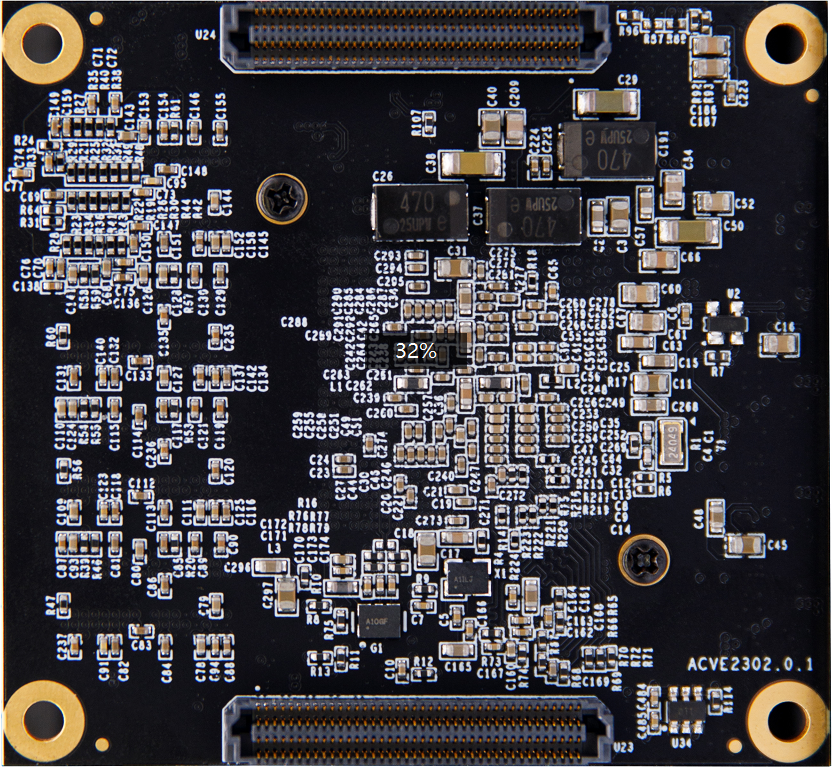
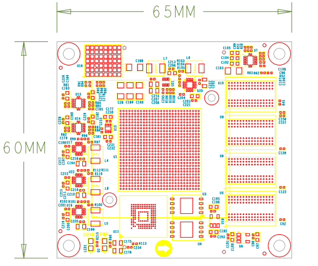
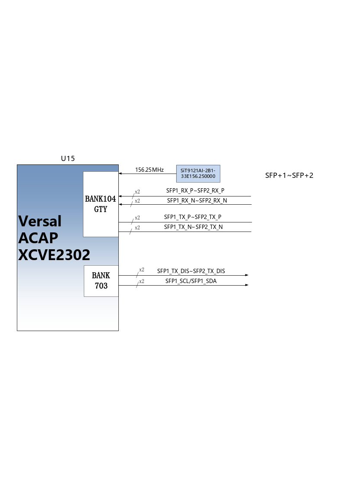
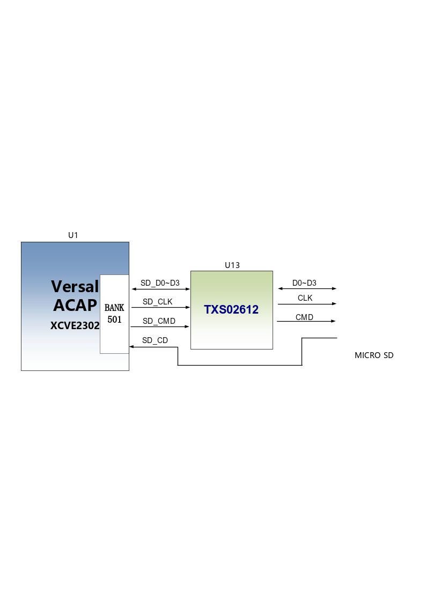
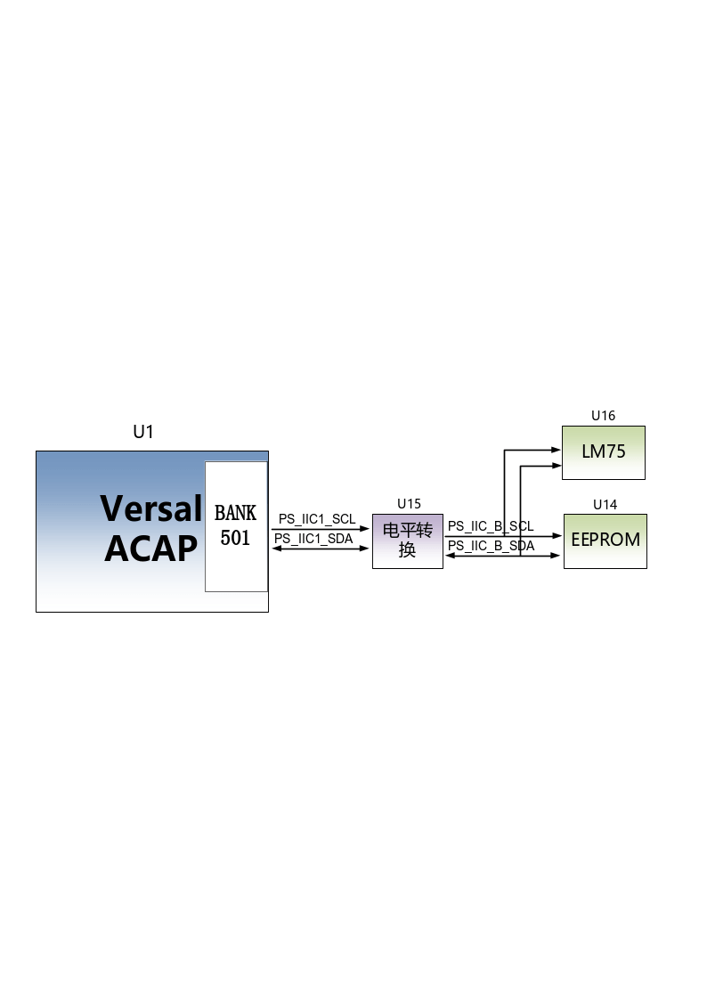
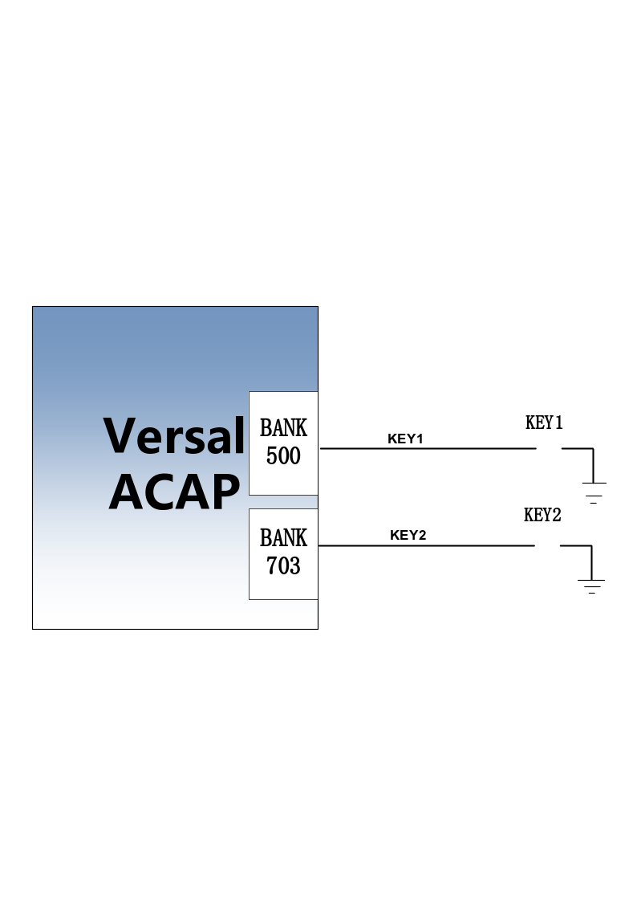
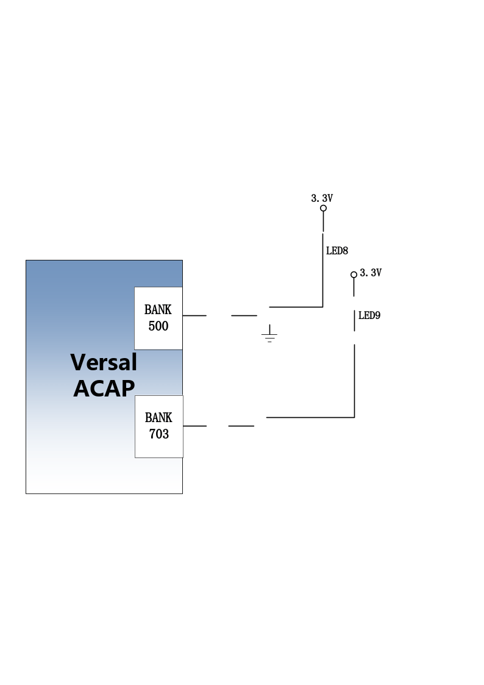
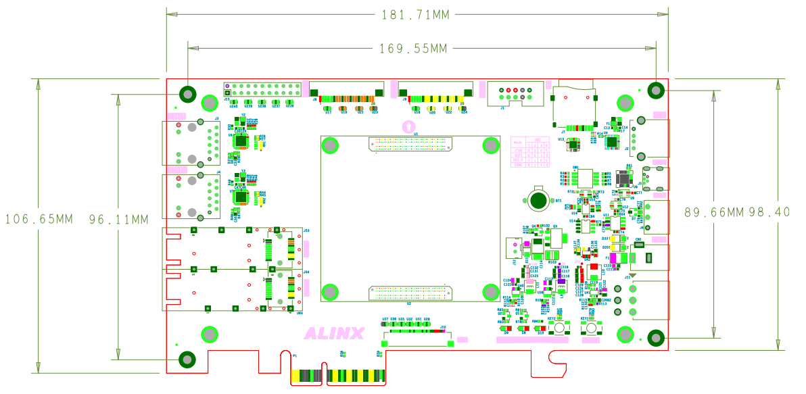
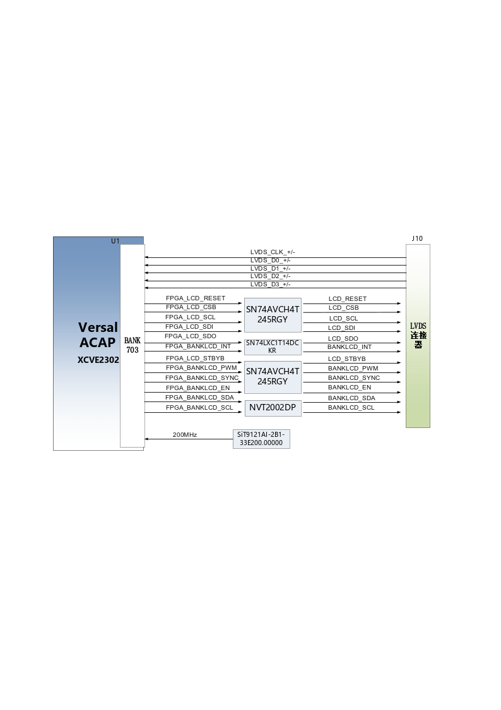

The Adaptive Computing Acceleration Platform (ACAP) (Model: VD100) of
the ALINX Versal AI Edge series has been officially released. In order
to let you quickly understand this development platform, we have written
this user manual.

This Versal AI Edge development platform uses a core board plus
expansion board model to facilitate users’ secondary development and
utilization of the core board. In the baseboard design, we used 1 1
2-pin PMOD interface, 2 10G optical fiber interfaces, 2 Ethernet ports,
2 MIPI interfaces, 1 USB2.0 interface, 1 UART interface and 1 PCIe3.0X4
interface. It meets users' requirements for high-speed data transmission
and exchange and is a "professional-level" and "all-around-level"
development platform for data communications. I believe that such a
product is very suitable for students, engineers and other groups
engaged in artificial intelligence, data acceleration and video image
processing.

.. image:: images/media/image2.png
   :width: 6.29097in
   :height: 3.49583in

Development board introduction
==============================

Here, a brief function introduction of this Versal AI VD100 platform is
given.

The entire structure of the development board is designed based on our
consistent core board + expansion board model. The core board and the
expansion board are connected using high-speed inter-board connectors.

The core board is mainly composed of Versal AI VE2302 + 4 DDR4 + QSPI
FLASH + EMMC. The VE2302 chip of the Versal AI Series we selected is
packaged in SFVA784. The data bit width of VE2302 and DDR4 is 64 bits,
the capacity of DDR4 is up to 4GB, and the data rate is 3200bps. Meet
the need for high buffers during data processing. In addition, there are
8G EMMC and 512Mbit QSPI FLASH on the core board for system startup and
data storage.

The base board is equipped with a wealth of peripheral interfaces. The
following figure is a schematic structural diagram of the entire VD100
platform:

.. image:: images/media/image3.png

Through this schematic diagram, we can see the functions that our
development platform can achieve.

-   Versal AI VE2302 core board

It is composed of VE2302+4GB DDR4+8G EMMC+512Mb QSPI FLASH, and there
are two high-precision Sitime crystal oscillators, one is single-ended
33.3333MHz, the other is differential 200MHz, providing stable clock
input for the VE2302 system and logic unit.

-  1 0/100M /1000M Ethernet RJ-45 interface

2-way Gigabit Ethernet interface, the chip uses Jinglue Company's JL2121
Ethernet PH Y chip to provide users with network communication services.
JL2121 The chip supports 10/100/1000 Mbps network transmission rate;
full duplex and adaptive.

-  USB Uart debugging interface

1-way Uart to USB interface, used to communicate with the computer to
facilitate user debugging. The serial port chip uses the USB- UAR chip
of Silicon Labs CP210 2 GM , and the USB interface uses the MINI USB
interface.

-  PCIe x 4 interface

Supports PCI Express 3.0 standard and provides standard PCIe x 4 high -
speed data transmission interface.

-  Micro SD card holder

1-way Micro SD card holder for storing operating system images and file
systems .

-  USB2.0 interface

..

   1 high-speed USB2.0 interface can be used to connect the development
   board to USB peripherals such as mouse, keyboard, and USB flash
   drive.

-  MIPI interface

..

   2-way MIPI interface, supports MIPI 4xLane, can be connected to ALINX
   MIPI camera (AN5010) .

-  LVDS interface

1-way LVDS interface, used to connect to ALINX’s LVDS display.

-  2-way SFP+ optical fiber interface

The 2-channel high-speed transceiver of the GTY transceiver is connected
to the sending and receiving of 2 optical modules to realize 2-channel
high-speed optical fiber communication interface. The optical fiber data
communication reception and transmission speed of each channel is as
high as 12.5Gb/s.

-  CAN communication interface

1-way CAN/CAN FD bus interface uses TI's TJA1051T chip, and the
interface uses a 3-Pin green terminal block .

-  12-pin PMOD expansion port

One 12-pin 2.54mm pitch expansion IO port is reserved. The expansion
port includes 2 channels of 3.3V power supply, 2 channels of ground, and
8 channels of 3.3V IO ports.

-  JTAG port

10-pin 2.54mm standard JTAG port for downloading and debugging VE2302
programs;

-  button

There are 2 user buttons on the expansion board, one connected to the
MIO of the PS and one connected to the IO of the PL;

-  LED light

5 LEDs (2 on the core board and 3 on the expansion board);

VE2302 core board
=================

Introduction
------------

The V100 ( **core board model, the same below** ) core board is a
high-performance core board developed based on the
XCVE2302-SFVA784-1LP-ES chip of XILINX's Versal ACAP series. It has high
performance, low latency, edge computing, and low power. It has
characteristics such as high power consumption and is suitable for use
in data centers, video image processing, high-speed data processing,
etc.

   This core board uses 4 pieces of MT40A512M16LY-062E from MICRON.

This DDR4 chip has 64-bit data bus bandwidth and 4GB capacity; the
maximum operating speed of DDR4 SDRAM can reach 1600MHz (data rate
3200Mbps). In addition, the core board also integrates two 256MBit QSPI
FLASH and one 8GB EMMC chip for startup storage configuration and system
files.

   The PS side of this core board has expanded 53 1.8V level standard
   MIOs, and the PL side has expanded 22 3.3V level standard IOs, 54
   1.8V level standard IO ports, and 30 1.2V level standard IOs. There
   are also 8 pairs of GTY high-speed RX/TX differential signals.
   Moreover, the wiring between the FPGA chip and the interface has been
   processed with equal length and differential processing, and the size
   of the core board is only 65*60 (mm), which is very suitable for
   secondary development.

.. image:: images/media/image4.png
   :width: 4.75208in
   :height: 4.40139in

V100 core board front view

V100 core board back view

VE2302
------

As mentioned before, the Versal ACAP model we use is
XCVE2302-SFVA784-1LP-ES, the speed level is 1, the operating temperature
is 0~100 ℃ , and the package is SFVA784. The chip naming rules of Versal
ACAP are as follows:

.. image:: images/media/image6.png
   :width: 6.29444in
   :height: 4.37361in

The VE2302 chip integrates 4 ARM Cortex™-A 72 processors and 2 Cortex
-R5F processors , as well as 34 AI Engines-ML acceleration units and 464
DSP processing units. The internal resources of VE2302 are as follows:

.. image:: images/media/image7.png
   :width: 6.28958in
   :height: 3.75347in

Clock configuration
-------------------

The V100 core board provides a reference clock and an RTC real-time
clock for the PS system and PL logic parts respectively, so that the PS
system and PL logic can work independently. The schematic diagram of the
clock circuit design is shown in Figure 2-3-1 below :

.. image:: images/media/image8.png

Figure 2- 3-1 Core board clock source

**PS system RTC real-time clock**

The passive crystal Y1 on the core board provides a 3 2.768K Hz
real-time clock source for the PS system . The crystal is connected to
the RTC_PADI_503 and RTC_PAD O_503 pins of BANK503 of the VE2302 chip .

**PS system clock source**

1 crystal oscillator on the core board provides a 33.333MHz clock input
to the PS system . The clock input is connected to the PS_REF_CLK_503
pin of BANK503 of the VE2302 chip.

**PL system clock source**

The board provides a differential 200MHz PL system clock source for the
reference clock of the DDR4 controller. The crystal oscillator output is
connected to the global clock (GC) of PL BANK701. This global clock can
be used to drive the DDR4 controller and user logic circuits in the
FPGA.

**PL clock pin assignment:**

+--------------------+----------------------------+--------------------+
| Signal name        | VE2302 pin name            | VE2302 pin number  |
+--------------------+----------------------------+--------------------+
| PL_CLK0_N          | I                          | AC23               |
|                    | O_L                        |                    |
|                    | 24N_GC_XCC_N8P1_M0P103_701 |                    |
+--------------------+----------------------------+--------------------+
| PL_CLK0_P          | IO_L                       | AB23               |
|                    | 24P_GC_XCC_N8P0_M0P102_701 |                    |
+--------------------+----------------------------+--------------------+

DDR4 DRAM
---------

The V100 core board is equipped with 4 Micron 1GB DDR 4 chips, model
MT40A512M16LY-062E . The 4 DDR4 chips are hung on the XPIO of BANK700,
701 and 702 to form a 64-bit data bus bandwidth and 4GB capacity . . DDR
4 SDRAM operates at a maximum speed of 1600 MHz (data rate 3200Mbps) .
The specific configuration of DDR 4 SDRAM is shown in Table 2-4-1 below
.

+----------------+---------------------+----------------+-------------+
| **bit number** | **Chip model**      | **capacity**   | **factory** |
+----------------+---------------------+----------------+-------------+
| U5, U 8 , U 9, | MT40A512M16LY-062E  | 512M x 16bit   | Micron      |
| U10            |                     |                |             |
+----------------+---------------------+----------------+-------------+

Table 2-4-1 DDR 4 SDRAM configuration

The hardware design of DDR4 requires strict consideration of signal
integrity. We have fully considered matching resistors/terminal
resistors, trace impedance control, and trace equal length control
during circuit design and PCB design to ensure the high-speed and stable
operation of DDR4. The hardware connection method of DDR4 is shown in
Figure 2-4-1 :

.. image:: images/media/image9.png

Figure 2-4-1 DDR4 DRAM schematic part

**DDR4 SDRAM pin assignment:**

+--------------------+--------------------------------+---------------+
| **Signal name**    | **Pin name**                   | **Pin         |
|                    |                                | number**      |
+--------------------+--------------------------------+---------------+
| PL_DDR4_A0         | IO_L18P_XCC_N6P0_M0P36_700     | AB12          |
+--------------------+--------------------------------+---------------+
| PL_DDR4_A1         | IO_L17N_N5P5_M0P35_700         | AE22          |
+--------------------+--------------------------------+---------------+
| PL_DDR4_A2         | IO_L17P_N5P4_M0P34_700         | AD22          |
+--------------------+--------------------------------+---------------+
| PL_DDR4_A3         | IO_L20P_N6P4_M0P40_700         | AB15          |
+--------------------+--------------------------------+---------------+
| PL_DDR4_A4         | IO_L12P_GC_XCC_N4P0_M0P24_700  | AD12          |
+--------------------+--------------------------------+---------------+
| PL_DDR4_A5         | IO_L26P_N8P4_M0P52_700         | AE17          |
+--------------------+--------------------------------+---------------+
| PL_DDR4_A6         | IO_L24P_GC_XCC_N8P0_M0P48_700  | AD16          |
+--------------------+--------------------------------+---------------+
| PL_DDR4_A7         | IO_L6N_GC_XCC_N2P1_M0P13_700   | AG11          |
+--------------------+--------------------------------+---------------+
| PL_DDR4_A8         | IO_L25N_N8P3_M0P51_700         | AE14          |
+--------------------+--------------------------------+---------------+
| PL_DDR4_A9         | IO_L19P_N6P2_M0P38_700         | AB14          |
+--------------------+--------------------------------+---------------+
| PL_DDR4_A10        | IO_L21N_XCC_N7P1_M0P43_700     | AB17          |
+--------------------+--------------------------------+---------------+
| PL_DDR4_A11        | IO_L25P_N8P2_M0P50_700         | AE13          |
+--------------------+--------------------------------+---------------+
| PL_DDR4_A12        | IO_L0N_XCC_N0P1_M0P1_700       | AH12          |
+--------------------+--------------------------------+---------------+
| PL_DDR4_A13        | IO_L24N_GC_XCC_N8P1_M0P49_700  | AD15          |
+--------------------+--------------------------------+---------------+
| PL_DDR4_CLK_N      | IO_L15N_XCC_N5P1_M0P31_700     | AD19          |
+--------------------+--------------------------------+---------------+
| PL_DDR4_CLK_P      | IO_L15P_XCC_N5P0_M0P30_700     | AC19          |
+--------------------+--------------------------------+---------------+
| PL_DDR4_BA0        | IO_L20N_N6P5_M0P41_700         | AC16          |
+--------------------+--------------------------------+---------------+
| PL_DDR4_BA1        | IO_L12N_GC_XCC_N4P1_M0P25_700  | AD11          |
+--------------------+--------------------------------+---------------+
| PL_DDR4_WE_B       | IO_L16N_N5P3_M0P33_700         | AD21          |
+--------------------+--------------------------------+---------------+
| PL_DDR4_CAS_B      | IO_L14N_N4P5_M0P29_700         | AD17          |
+--------------------+--------------------------------+---------------+
| PL_DDR4_CS_B       | IO_L14P_N4P4_M0P28_700         | AC17          |
+--------------------+--------------------------------+---------------+
| PL_DDR4_ACT_B      | IO_L18N_XCC_N6P1_M0P37_700     | AC11          |
+--------------------+--------------------------------+---------------+
| PL_DDR4_RAS_B      | IO_L19N_N6P3_M0P39_700         | AC13          |
+--------------------+--------------------------------+---------------+
| PL_DDR4_BG0        | IO_L21P_XCC_N7P0_M0P42_700     | AB18          |
+--------------------+--------------------------------+---------------+
| PL_DDR4_ODT        | IO_L23N_N7P5_M0P47_700         | AC22          |
+--------------------+--------------------------------+---------------+
| PL_DDR4_CKE        | IO_L23P_N7P4_M0P46_700         | AB21          |
+--------------------+--------------------------------+---------------+
| PL_DDR4_RST        | IO_L25P_N8P2_M0P104_701        | AC24          |
+--------------------+--------------------------------+---------------+
| PL_DDR4_DQS0_N     | IO_L9N_GC_XCC_N3P1_M0P19_700   | AG16          |
+--------------------+--------------------------------+---------------+
| PL_DDR4_DQS0_P     | IO_L9P_GC_XCC_N3P0_M0P18_700   | AG17          |
+--------------------+--------------------------------+---------------+
| PL_DDR4_DQS1_N     | IO_L3N_XCC_N1P1_M0P7_700       | AH19          |
+--------------------+--------------------------------+---------------+
| PL_DDR4_DQS1_P     | IO_L3P_XCC_N1P0_M0P6_700       | AG20          |
+--------------------+--------------------------------+---------------+
| PL_DDR4_DQS2_N     | IO_L6N_GC_XCC_N2P1_M0P67_701   | AD27          |
+--------------------+--------------------------------+---------------+
| PL_DDR4_DQS2_P     | IO_L6P_GC_XCC_N2P0_M0P66_701   | AC28          |
+--------------------+--------------------------------+---------------+
| PL_DDR4_DQS3_N     | IO_L3N_XCC_N1P1_M0P61_701      | AF23          |
+--------------------+--------------------------------+---------------+
| PL_DDR4_DQS3_P     | IO_L3P_XCC_N1P0_M0P60_701      | AF24          |
+--------------------+--------------------------------+---------------+
| PL_DDR4_DQS4_N     | IO_L15N_XCC_N5P1_M0P85_701     | AA23          |
+--------------------+--------------------------------+---------------+
| PL_DDR4_DQS4_P     | IO_L15P_XCC_N5P0_M0P84_701     | Y24           |
+--------------------+--------------------------------+---------------+
| PL_DDR4_DQS5_N     | IO_L21N_XCC_N7P1_M0P97_701     | Y27           |
+--------------------+--------------------------------+---------------+
| PL_DDR4_DQS5_P     | IO_L21P_XCC_N7P0_M0P96_701     | Y28           |
+--------------------+--------------------------------+---------------+
| PL_DDR4_DQS6_N     | IO_L0N_XCC_N0P1_M0P109_702     | U28           |
+--------------------+--------------------------------+---------------+
| PL_DDR4_DQS6_P     | IO_L0P_XCC_N0P0_M0P108_702     | U27           |
+--------------------+--------------------------------+---------------+
| PL_DDR4_DQS7_N     | IO_L9N_GC_XCC_N3P1_M0P127_702  | N27           |
+--------------------+--------------------------------+---------------+
| PL_DDR4_DQS7_P     | IO_L9P_GC_XCC_N3P0_M0P126_702  | P26           |
+--------------------+--------------------------------+---------------+
| PL_DDR4_DM0        | IO_L6P_GC_XCC_N2P0_M0P12_700   | AG12          |
+--------------------+--------------------------------+---------------+
| PL_DDR4_DM1        | IO_L0P_XCC_N0P0_M0P0_700       | AH13          |
+--------------------+--------------------------------+---------------+
| PL_DDR4_DM2        | IO_L9P_GC_XCC_N3P0_M0P72_701   | AE28          |
+--------------------+--------------------------------+---------------+
| PL_DDR4_DM3        | IO_L0P_XCC_N0P0_M0P54_701      | AD24          |
+--------------------+--------------------------------+---------------+
| PL_DDR4_DM4        | IO_L12P_GC_XCC_N4P0_M0P78_701  | V22           |
+--------------------+--------------------------------+---------------+
| PL_DDR4_DM5        | IO_L18P_XCC_N6P0_M0P90_701     | V28           |
+--------------------+--------------------------------+---------------+
| PL_DDR4_DM6        | IO_L3P_XCC_N1P0_M0P114_702     | N28           |
+--------------------+--------------------------------+---------------+
| PL_DDR4_DM7        | IO_L6P_GC_XCC_N2P0_M0P120_702  | U25           |
+--------------------+--------------------------------+---------------+
| PL_DDR4_DQ0        | IO_L8P_N2P4_M0P16_700          | AF14          |
+--------------------+--------------------------------+---------------+
| PL_DDR4_DQ1        | IO_L10N_N3P3_M0P21_700         | AG18          |
+--------------------+--------------------------------+---------------+
| PL_DDR4_DQ2        | IO_L8N_N2P5_M0P17_700          | AG15          |
+--------------------+--------------------------------+---------------+
| PL_DDR4_DQ3        | IO_L10P_N3P2_M0P20_700         | AF18          |
+--------------------+--------------------------------+---------------+
| PL_DDR4_DQ4        | IO_L7P_N2P2_M0P14_700          | AF13          |
+--------------------+--------------------------------+---------------+
| PL_DDR4_DQ5        | IO_L11N_N3P5_M0P23_700         | AF19          |
+--------------------+--------------------------------+---------------+
| PL_DDR4_DQ6        | IO_L7N_N2P3_M0P15_700          | AG13          |
+--------------------+--------------------------------+---------------+
| PL_DDR4_DQ7        | IO_L11P_N3P4_M0P22_700         | AE19          |
+--------------------+--------------------------------+---------------+
| PL_DDR4_DQ8        | IO_L2P_N0P4_M0P4_700           | AH17          |
+--------------------+--------------------------------+---------------+
| PL_DDR4_DQ9        | IO_L4P_N1P2_M0P8_700           | AG21          |
+--------------------+--------------------------------+---------------+
| PL_DDR4_DQ10       | IO_L2N_N0P5_M0P5_700           | AH18          |
+--------------------+--------------------------------+---------------+
| PL_DDR4_DQ11       | IO_L4N_N1P3_M0P9_700           | AH20          |
+--------------------+--------------------------------+---------------+
| PL_DDR4_DQ12       | IO_L1P_N0P2_M0P2_700           | AH14          |
+--------------------+--------------------------------+---------------+
| PL_DDR4_DQ13       | IO_L5N_N1P5_M0P11_700          | AH22          |
+--------------------+--------------------------------+---------------+
| PL_DDR4_DQ14       | IO_L1N_N0P3_M0P3_700           | AH15          |
+--------------------+--------------------------------+---------------+
| PL_DDR4_DQ15       | IO_L5P_N1P4_M0P10_700          | AG22          |
+--------------------+--------------------------------+---------------+
| PL_DDR4_DQ16       | IO_L8N_N2P5_M0P71_701          | AF26          |
+--------------------+--------------------------------+---------------+
| PL_DDR4_DQ17       | IO_L7N_N2P3_M0P69_701          | AE26          |
+--------------------+--------------------------------+---------------+
| PL_DDR4_DQ18       | IO_L10N_N3P3_M0P75_701         | AH27          |
+--------------------+--------------------------------+---------------+
| PL_DDR4_DQ19       | IO_L8P_N2P4_M0P70_701          | AE27          |
+--------------------+--------------------------------+---------------+
| PL_DDR4_DQ20       | IO_L11N_N3P5_M0P77_701         | AG27          |
+--------------------+--------------------------------+---------------+
| PL_DDR4_DQ21       | IO_L7P_N2P2_M0P68_701          | AD26          |
+--------------------+--------------------------------+---------------+
| PL_DDR4_DQ22       | IO_L11P_N3P4_M0P76_701         | AG26          |
+--------------------+--------------------------------+---------------+
| PL_DDR4_DQ23       | IO_L10P_N3P2_M0P74_701         | AG28          |
+--------------------+--------------------------------+---------------+
| PL_DDR4_DQ24       | IO_L1N_N0P3_M0P57_701          | AE24          |
+--------------------+--------------------------------+---------------+
| PL_DDR4_DQ25       | IO_L1P_N0P2_M0P56_701          | AD25          |
+--------------------+--------------------------------+---------------+
| PL_DDR4_DQ26       | IO_L5P_N1P4_M0P64_701          | AH24          |
+--------------------+--------------------------------+---------------+
| PL_DDR4_DQ27       | IO_L2P_N0P4_M0P58_701          | AF25          |
+--------------------+--------------------------------+---------------+
| PL_DDR4_DQ28       | IO_L4P_N1P2_M0P62_701          | AG23          |
+--------------------+--------------------------------+---------------+
| PL_DDR4_DQ29       | IO_L2N_N0P5_M0P59_701          | AG25          |
+--------------------+--------------------------------+---------------+
| PL_DDR4_DQ30       | IO_L4N_N1P3_M0P63_701          | AH23          |
+--------------------+--------------------------------+---------------+
| PL_DDR4_DQ31       | IO_L5N_N1P5_M0P65_701          | AH25          |
+--------------------+--------------------------------+---------------+
| PL_DDR4_DQ32       | IO_L17P_N5P4_M0P88_701         | Y22           |
+--------------------+--------------------------------+---------------+
| PL_DDR4_DQ33       | IO_L13P_N4P2_M0P80_701         | V23           |
+--------------------+--------------------------------+---------------+
| PL_DDR4_DQ34       | IO_L16P_N5P2_M0P86_701         | Y23           |
+--------------------+--------------------------------+---------------+
| PL_DDR4_DQ35       | IO_L13N_N4P3_M0P81_701         | W24           |
+--------------------+--------------------------------+---------------+
| PL_DDR4_DQ36       | IO_L16N_N5P3_M0P87_701         | AA22          |
+--------------------+--------------------------------+---------------+
| PL_DDR4_DQ37       | IO_L14P_N4P4_M0P82_701         | V24           |
+--------------------+--------------------------------+---------------+
| PL_DDR4_DQ38       | IO_L17N_N5P5_M0P89_701         | AA21          |
+--------------------+--------------------------------+---------------+
| PL_DDR4_DQ39       | IO_L14N_N4P5_M0P83_701         | W25           |
+--------------------+--------------------------------+---------------+
| PL_DDR4_DQ40       | IO_L19P_N6P2_M0P92_701         | V25           |
+--------------------+--------------------------------+---------------+
| PL_DDR4_DQ41       | IO_L20P_N6P4_M0P94_701         | W27           |
+--------------------+--------------------------------+---------------+
| PL_DDR4_DQ42       | IO_L22P_N7P2_M0P98_701         | AA28          |
+--------------------+--------------------------------+---------------+
| PL_DDR4_DQ43       | IO_L19N_N6P3_M0P93_701         | W26           |
+--------------------+--------------------------------+---------------+
| PL_DDR4_DQ44       | IO_L20N_N6P5_M0P95_701         | Y26           |
+--------------------+--------------------------------+---------------+
| PL_DDR4_DQ45       | IO_L23P_N7P4_M0P100_701        | AA26          |
+--------------------+--------------------------------+---------------+
| PL_DDR4_DQ46       | IO_L22N_N7P3_M0P99_701         | AB28          |
+--------------------+--------------------------------+---------------+
| PL_DDR4_DQ47       | IO_L23N_N7P5_M0P101_701        | AB26          |
+--------------------+--------------------------------+---------------+
| PL_DDR4_DQ48       | IO_L2P_N0P4_M0P112_702         | P27           |
+--------------------+--------------------------------+---------------+
| PL_DDR4_DQ49       | IO_L5P_N1P4_M0P118_702         | K27           |
+--------------------+--------------------------------+---------------+
| PL_DDR4_DQ50       | IO_L2N_N0P5_M0P113_702         | R28           |
+--------------------+--------------------------------+---------------+
| PL_DDR4_DQ51       | IO_L4N_N1P3_M0P117_702         | L28           |
+--------------------+--------------------------------+---------------+
| PL_DDR4_DQ52       | IO_L1P_N0P2_M0P110_702         | R27           |
+--------------------+--------------------------------+---------------+
| PL_DDR4_DQ53       | IO_L5N_N1P5_M0P119_702         | K28           |
+--------------------+--------------------------------+---------------+
| PL_DDR4_DQ54       | IO_L1N_N0P3_M0P111_702         | T28           |
+--------------------+--------------------------------+---------------+
| PL_DDR4_DQ55       | IO_L4P_N1P2_M0P116_702         | M27           |
+--------------------+--------------------------------+---------------+
| PL_DDR4_DQ56       | IO_L8P_N2P4_M0P124_702         | P25           |
+--------------------+--------------------------------+---------------+
| PL_DDR4_DQ57       | IO_L10N_N3P3_M0P129_702        | L26           |
+--------------------+--------------------------------+---------------+
| PL_DDR4_DQ58       | IO_L8N_N2P5_M0P125_702         | R26           |
+--------------------+--------------------------------+---------------+
| PL_DDR4_DQ59       | IO_L10P_N3P2_M0P128_702        | M26           |
+--------------------+--------------------------------+---------------+
| PL_DDR4_DQ60       | IO_L7P_N2P2_M0P122_702         | T25           |
+--------------------+--------------------------------+---------------+
| PL_DDR4_DQ61       | IO_L11N_N3P5_M0P131_702        | K26           |
+--------------------+--------------------------------+---------------+
| PL_DDR4_DQ62       | IO_L7N_N2P3_M0P123_702         | T26           |
+--------------------+--------------------------------+---------------+
| PL_DDR4_DQ63       | IO_L11P_N3P4_M0P130_702        | J25           |
+--------------------+--------------------------------+---------------+

QSPI Flash
----------

The core board uses two 256 M bit Q SPI FLASH chips, model
MT25QU256ABA1EW9-0SIT, which uses the 1.8 V CMOS voltage standard. Due
to its non-volatile characteristics, QSPI FLASH can be used as the boot
image of the FPGA system during use . These images mainly include FPGA
bit files, soft core application codes and other user data files.

The specific models and related parameters of QSPI FLASH are shown in
the table below

+----------+--------------------------+-----------------+-------------+
| **bit    | **Chip type**            | **capacity**    | **factory** |
| number** |                          |                 |             |
+----------+--------------------------+-----------------+-------------+
| U3,U4    | MT25QU256ABA1EW9-0SIT    | 256MB Bit       | Micron      |
+----------+--------------------------+-----------------+-------------+

..

   Table 2-5-1 QSPI Flash models and parameters

BANK500 in the PS part of the Versal ACAP chip . In the system design,
the MIO port functions of these PS terminals need to be configured as
QSPI FLASH interface.\ |image1|

Figure 2- 5-1 QSPI Flash connection diagram

**Configure chip pin assignments:**

+----------------------+----------------------------+-----------------+
| **Signal name**      | **Pin name**               | **Pin number**  |
+----------------------+----------------------------+-----------------+
| MIO0_QSPI0_SCLK      | PMC_MIO0_500               | AA1             |
+----------------------+----------------------------+-----------------+
| MIO1_QSPI0_IO1       | PMC_MIO1_500               | AB1             |
+----------------------+----------------------------+-----------------+
| MIO2_QSPI0_IO2       | PMC_MIO2_500               | AD1             |
+----------------------+----------------------------+-----------------+
| MIO3_QSPI0_IO3       | PMC_MIO3_500               | AE1             |
+----------------------+----------------------------+-----------------+
| MIO4_QSPI0_IO0       | PMC_MIO4_500               | AF1             |
+----------------------+----------------------------+-----------------+
| MIO5_QSPI0_SS_B      | PMC_MIO5_500               | AG1             |
+----------------------+----------------------------+-----------------+
| MIO7_QSPI1_SS_B      | PMC_MIO7_500               | AG2             |
+----------------------+----------------------------+-----------------+
| MIO8_QSPI1_IO0       | PMC_MIO8_500               | AE2             |
+----------------------+----------------------------+-----------------+
| MIO9_QSPI1_IO1       | PMC_MIO9_500               | AD2             |
+----------------------+----------------------------+-----------------+
| MIO10_QSPI1_IO2      | PMC_MIO10_500              | AC2             |
+----------------------+----------------------------+-----------------+
| MIO11_QSPI1_IO3      | PMC_MIO11_500              | AB2             |
+----------------------+----------------------------+-----------------+
| MIO12_QSPI1_SCLK     | PMC_MIO12_500              | AA3             |
+----------------------+----------------------------+-----------------+

eMMC Flash
----------

The V100 core board is equipped with a large-capacity 8GB eMMC FLASH
chip, model MTFC8GAKAJCN-4M . It supports the JEDEC e-MMC V5.0 standard
HS-MMC interface, and the level supports 1.8V or 3.3V . The data width
of eMMC FLASH and ACAP connections is 8bit. Due to the large capacity
and non-volatile characteristics of eMMC FLASH , it can be used as a
large-capacity storage device in the ACAP system , such as storing ARM
applications , system files and other user data files. The specific
models and related parameters of eMMC FLASH are shown in Table 2-6-1 .

+--------------+--------------------+------------------+--------------+
| **bit        | **Chip type**      | **capacity**     | **factory**  |
| number**     |                    |                  |              |
+--------------+--------------------+------------------+--------------+
| U8           | MTFC8GAKAJCN-4M    | 8G Byte          | Micron       |
+--------------+--------------------+------------------+--------------+

Table 2-6-1 \_ \_ eMMC Flash model and parameters

eMMC FLASH is connected to the PMC MIO port of BANK50 1 of the PS part
of Versal ACAP. In the system design, these PMC MIO port functions need
to be configured as EMMC interfaces. Figure 2-6-1 is eMMC The part of
Flash in the schematic.

.. image:: images/media/image11.png

Figure 2- 6-1 eMMC Flash connection diagram

**Configure chip pin assignments:**

+--------------------------+-------------------------+-----------------+
| **Signal name**          | **Pin name**            | **Pin number**  |
+--------------------------+-------------------------+-----------------+
| MMC_CCLK                 | PMC_MIO38_501           | AE8             |
+--------------------------+-------------------------+-----------------+
| MMC_CMD                  | PMC_MIO40_501           | AB8             |
+--------------------------+-------------------------+-----------------+
| MMC_DAT0                 | PMC_MIO41_501           | AA8             |
+--------------------------+-------------------------+-----------------+
| MMC_DAT1                 | PMC_MIO42_501           | AA9             |
+--------------------------+-------------------------+-----------------+
| MMC_DAT2                 | PMC_MIO43_501           | AC9             |
+--------------------------+-------------------------+-----------------+
| MMC_DAT3                 | PMC_MIO44_501           | AD9             |
+--------------------------+-------------------------+-----------------+
| MMC_DAT4                 | PMC_MIO45_501           | AE9             |
+--------------------------+-------------------------+-----------------+
| MMC_DAT5                 | PMC_MIO46_501           | AF9             |
+--------------------------+-------------------------+-----------------+
| MMC_DAT6                 | PMC_MIO47_501           | AF10            |
+--------------------------+-------------------------+-----------------+
| MMC_DAT7                 | PMC_MIO48_501           | AD10            |
+--------------------------+-------------------------+-----------------+
| MMC_RSTN                 | PMC_MIO49_501           | AC10            |
+--------------------------+-------------------------+-----------------+

LED light
---------

There is one red power indicator light (PWR) and one configuration LED
light (DONE) on the V100 core board. When the core board is powered, the
power indicator light will light up; when the FPGA configures the
program, the configuration LED light will light up. The schematic
diagram of LED light hardware connection is shown in Figure 2-7-1:

.. image:: images/media/image12.png

Figure 2-7-1 Development board LED light hardware connection diagram

power supply
------------

the V100 core board is 7.5V~15V (typical value 12V), and the core board
is powered by connecting to the base board. The core board uses the
MYMGM1R824ELA5RA power chip to provide core power 0.7V for XCVE2302. In
addition, the power supply for BANK503, BANK700, and BANK302 is
generated by the DCDC chip TLV62130RGT. The power supply for BANK703 and
GTY transceivers is generated by the LDO chip.

.. image:: images/media/image13.png

Because the power supply of Versal ACAP FPGA has power-on sequence
requirements, in the circuit design, we have designed the power-on
sequence according to the power requirements of the chip as follows:

1). VCCIO503(3.3V), VCCO302(3.3V), VCCIO_501/502/503 ( 1. 8 V ),

VCCIO700/701/702(1.2V)

1. VCCINT/VCC_PMC/VCC_PSFP/VCC_PSLP(0.7V)

2. VCCBRAM /VCC_SOC/VCC_IO ( 0.8 V)

3. VCCAUX/VCCAUX_PMC/VCCAUX_SMON( 1. 5 V )

5.GTYP_AVCC (0.9V)

6. GTYP_AVTT(1.2V)

Extension ports
---------------

A total of 2 high-speed expansion ports are extended on the back of the
core board. Two 160Pin inter-board connectors (Samtec:
ADF6-40-03.5-L-4-2-A-TR ) are used to connect to the bottom board. The
FPGA IO port passes through Differential wiring is connected to these
two expansion ports. The PIN pitch of the connector is 0.5mm, and it is
configured with the female connector on the base plate to achieve
high-speed data communication.

**Expansion port U23A**

The 160Pin connector U23 is used to connect the VCCIN power supply
(+12V), ground and the common IO of the FPGA on the backplane. It should
be noted here that the A and B columns of U23 are connected to the IO
ports of BANK702 and PS. The pin assignment of the U23_AB expansion port
is shown in Table 2-9-1:

**2-9-1 Table: Expansion port U23_AB pin assignment**

+------+-------------+------+-----+------+------------+------+-----+
| U23  | Signal      | FPGA | le  | U23  | Signal     | FPGA | le  |
| pin  |             |      | vel |      |            |      | vel |
|      | name        | Pin  | st  | Pin  | name       | Pin  | st  |
|      |             | nu   | and |      |            | nu   | and |
|      |             | mber | ard |      |            | mber | ard |
+------+-------------+------+-----+------+------------+------+-----+
| A1   | B702_L17_N  | J24  | 1   | B1   | B702_L12_N | T24  | 1   |
|      |             |      | .2V |      |            |      | .2V |
+------+-------------+------+-----+------+------------+------+-----+
| A2   | B702_L17_P  | K23  | 1   | B2   | B702_L12_P | U23  | 1   |
|      |             |      | .2V |      |            |      | .2V |
+------+-------------+------+-----+------+------------+------+-----+
| A3   | GND         | -    | l   | B3   | GND        | -    | l   |
|      |             |      | and |      |            |      | and |
+------+-------------+------+-----+------+------------+------+-----+
| A4   | B702_L25_N  | L25  | 1   | B4   | B702_L16_N | K24  | 1   |
|      |             |      | .2V |      |            |      | .2V |
+------+-------------+------+-----+------+------------+------+-----+
| A5   | B702_L25_P  | L24  | 1   | B5   | B702_L16_P | L23  | 1   |
|      |             |      | .2V |      |            |      | .2V |
+------+-------------+------+-----+------+------------+------+-----+
| A6   | GND         | -    | l   | B6   | GND        | -    | l   |
|      |             |      | and |      |            |      | and |
+------+-------------+------+-----+------+------------+------+-----+
| A7   | B702_L24_N  | N24  | 1   | B7   | B702_L21_N | M21  | 1   |
|      |             |      | .2V |      |            |      | .2V |
+------+-------------+------+-----+------+------------+------+-----+
| A8   | B702_L24_P  | N23  | 1   | B8   | B702_L21_P | N21  | 1   |
|      |             |      | .2V |      |            |      | .2V |
+------+-------------+------+-----+------+------------+------+-----+
| A9   | GND         | -    | l   | B9   | GND        | -    | l   |
|      |             |      | and |      |            |      | and |
+------+-------------+------+-----+------+------------+------+-----+
| A10  | B702_L22_N  | L22  | 1   | B10  | B302_L5_N  | C12  | 3   |
|      |             |      | .2V |      |            |      | .3V |
+------+-------------+------+-----+------+------------+------+-----+
| A11  | B702_L22_P  | K21  | 1   | B11  | B302_L5_P  | D11  | 3   |
|      |             |      | .2V |      |            |      | .3V |
+------+-------------+------+-----+------+------------+------+-----+
| A12  | GND         | -    | l   | B12  | GND        | -    | l   |
|      |             |      | and |      |            |      | and |
+------+-------------+------+-----+------+------------+------+-----+
| A13  | B302_L2_N   | D14  | 3   | B13  | B302_L0_N  | E14  | 3   |
|      |             |      | .3V |      |            |      | .3V |
+------+-------------+------+-----+------+------------+------+-----+
| A14  | B302_L2_P   | E13  | 3   | B14  | B302_L0_P  | F14  | 3   |
|      |             |      | .3V |      |            |      | .3V |
+------+-------------+------+-----+------+------------+------+-----+
| A15  | GND         | -    | l   | B15  | GND        | -    | l   |
|      |             |      | and |      |            |      | and |
+------+-------------+------+-----+------+------------+------+-----+
| A16  | PS_MIO31    | AD6  | 1   | B16  | PS_MIO35   | AC7  | 1   |
|      |             |      | .8V |      |            |      | .8V |
+------+-------------+------+-----+------+------------+------+-----+
| A17  | PS_MIO25    | Y4   | 1   | B17  | PS_MIO37   | AE7  | 1   |
|      |             |      | .8V |      |            |      | .8V |
+------+-------------+------+-----+------+------------+------+-----+
| A18  | GND         | -    | l   | B18  | GND        | -    | l   |
|      |             |      | and |      |            |      | and |
+------+-------------+------+-----+------+------------+------+-----+
| A19  | PS_MIO26    | AA5  | 1   | B19  | PS_MIO22   | AD4  | 1   |
|      |             |      | .8V |      |            |      | .8V |
+------+-------------+------+-----+------+------------+------+-----+
| A20  | PS_MIO33    | AA6  | 1   | B20  | PS_MIO19   | AH4  | 1   |
|      |             |      | .8V |      |            |      | .8V |
+------+-------------+------+-----+------+------------+------+-----+
| A21  | GND         | -    | l   | B21  | GND        | -    | l   |
|      |             |      | and |      |            |      | and |
+------+-------------+------+-----+------+------------+------+-----+
| A22  | PS_MIO32    | AB6  | 1   | B22  | PS_MIO20   | AF4  | 1   |
|      |             |      | .8V |      |            |      | .8V |
+------+-------------+------+-----+------+------------+------+-----+
| A23  | PS_MIO27    | AB5  | 1   | B23  | PS_MIO28   | AC5  | 1   |
|      |             |      | .8V |      |            |      | .8V |
+------+-------------+------+-----+------+------------+------+-----+
| A24  | GND         | -    | l   | B24  | GND        | -    | l   |
|      |             |      | and |      |            |      | and |
+------+-------------+------+-----+------+------------+------+-----+
| A25  | PS_MIO14    | AC3  | 1   | B25  | PS_MIO23   | AC4  | 1   |
|      |             |      | .8V |      |            |      | .8V |
+------+-------------+------+-----+------+------------+------+-----+
| A26  | PS_MIO13    | AB3  | 1   | B26  | PS_MIO24   | AA4  | 1   |
|      |             |      | .8V |      |            |      | .8V |
+------+-------------+------+-----+------+------------+------+-----+
| A27  | GND         | -    | l   | B27  | GND        | -    | l   |
|      |             |      | and |      |            |      | and |
+------+-------------+------+-----+------+------------+------+-----+
| A28  | LPD_MIO24   | Y8   | 1   | B28  | LPD_MIO4   | Y2   | 1   |
|      |             |      | .8V |      |            |      | .8V |
+------+-------------+------+-----+------+------------+------+-----+
| A29  | LPD_MIO23   | Y7   | 1   | B29  | LPD_MIO3   | Y1   | 1   |
|      |             |      | .8V |      |            |      | .8V |
+------+-------------+------+-----+------+------------+------+-----+
| A30  | GND         | -    | l   | B30  | GND        | -    | l   |
|      |             |      | and |      |            |      | and |
+------+-------------+------+-----+------+------------+------+-----+
| A31  | LPD_MIO5    | W2   | 1   | B31  | LPD_MIO18  | W5   | 1   |
|      |             |      | .8V |      |            |      | .8V |
+------+-------------+------+-----+------+------------+------+-----+
| A32  | LPD_MIO2    | W1   | 1   | B32  | LPD_MIO12  | W4   | 1   |
|      |             |      | .8V |      |            |      | .8V |
+------+-------------+------+-----+------+------------+------+-----+
| A33  | GND         | -    | l   | B33  | GND        | -    | l   |
|      |             |      | and |      |            |      | and |
+------+-------------+------+-----+------+------------+------+-----+
| A34  | LPD_MIO7    | U2   | 1   | B34  | LPD_MIO1   | U1   | 1   |
|      |             |      | .8V |      |            |      | .8V |
+------+-------------+------+-----+------+------------+------+-----+
| A35  | LPD_MIO6    | V2   | 1   | B35  | LPD_MIO13  | V4   | 1   |
|      |             |      | .8V |      |            |      | .8V |
+------+-------------+------+-----+------+------------+------+-----+
| A36  | GND         | -    | l   | B36  | GND        | -    | l   |
|      |             |      | and |      |            |      | and |
+------+-------------+------+-----+------+------------+------+-----+
| A37  | FPGA_TDI    | AG10 | 1   | B37  | FPGA_TCK   | AH10 | 1   |
|      |             |      | .8V |      |            |      | .8V |
+------+-------------+------+-----+------+------------+------+-----+
| A38  | FPGA_TMS    | AH9  | 1   | B38  | FPGA_TDO   | AF8  | 1   |
|      |             |      | .8V |      |            |      | .8V |
+------+-------------+------+-----+------+------------+------+-----+
| A39  | GND         | -    | l   | B39  | GND        | -    | l   |
|      |             |      | and |      |            |      | and |
+------+-------------+------+-----+------+------------+------+-----+
| A40  | +12V        |      | +12V| B40  | +12V       |      | +12V|
+------+-------------+------+-----+------+------------+------+-----+

**Expansion port U23_CD**

The pin assignment of the U23B expansion port is shown in Table 2-9-2:

**2-10-2 Table: Expansion port U23_CD pin assignment**

+------+-------------+-------+------+-----+-------------+------+-----+
| U23  | Signal      | FPGA  | l    | U23 | Signal      | FPGA | le  |
| pin  |             |       | evel |     |             |      | vel |
|      | name        | Pin   | stan | Pin | name        | Pin  | st  |
|      |             | n     | dard |     |             | nu   | and |
|      |             | umber |      |     |             | mber | ard |
+------+-------------+-------+------+-----+-------------+------+-----+
| C1   | B702_L13_N  | R24   | 1.2V | D1  | B702_L14_N  | P24  | 1   |
|      |             |       |      |     |             |      | .2V |
+------+-------------+-------+------+-----+-------------+------+-----+
| C2   | B702_L13_P  | T23   | 1.2V | D2  | B702_L14_P  | R23  | 1   |
|      |             |       |      |     |             |      | .2V |
+------+-------------+-------+------+-----+-------------+------+-----+
| C3   | GND         | -     | land | D3  | GND         | -    | l   |
|      |             |       |      |     |             |      | and |
+------+-------------+-------+------+-----+-------------+------+-----+
| C4   | B702_L26_N  | M25   | 1.2V | D4  | B702_L18_N  | U22  | 1   |
|      |             |       |      |     |             |      | .2V |
+------+-------------+-------+------+-----+-------------+------+-----+
| C5   | B702_L26_P  | N25   | 1.2V | D5  | B702_L18_P  | V21  | 1   |
|      |             |       |      |     |             |      | .2V |
+------+-------------+-------+------+-----+-------------+------+-----+
| C6   | GND         | -     | land | D6  | GND         | -    | l   |
|      |             |       |      |     |             |      | and |
+------+-------------+-------+------+-----+-------------+------+-----+
| C7   | B702_L23_N  | J22   | 1.2V | D7  | B702_L19_N  | R22  | 1   |
|      |             |       |      |     |             |      | .2V |
+------+-------------+-------+------+-----+-------------+------+-----+
| C8   | B702_L23_P  | J21   | 1.2V | D8  | B702_L19_P  | T21  | 1   |
|      |             |       |      |     |             |      | .2V |
+------+-------------+-------+------+-----+-------------+------+-----+
| C9   | GND         | -     | land | D9  | GND         | -    | l   |
|      |             |       |      |     |             |      | and |
+------+-------------+-------+------+-----+-------------+------+-----+
| C10  | B702_L15_N  | M23   | 1.2V | D10 | B702_L20_N  | P22  | 1   |
|      |             |       |      |     |             |      | .2V |
+------+-------------+-------+------+-----+-------------+------+-----+
| C11  | B702_L15_P  | M22   | 1.2V | D11 | B702_L20_P  | R21  | 1   |
|      |             |       |      |     |             |      | .2V |
+------+-------------+-------+------+-----+-------------+------+-----+
| C12  | GND         | -     | land | D12 | GND         | -    | l   |
|      |             |       |      |     |             |      | and |
+------+-------------+-------+------+-----+-------------+------+-----+
| C13  | B302_L3_N   | D12   | 3.3V | D13 | B302_L4_N   | E11  | 3   |
|      |             |       |      |     |             |      | .3V |
+------+-------------+-------+------+-----+-------------+------+-----+
| C14  | B302_L3_P   | E12   | 3.3V | D14 | B302_L4_P   | F11  | 3   |
|      |             |       |      |     |             |      | .3V |
+------+-------------+-------+------+-----+-------------+------+-----+
| C15  | GND         | -     | land | D15 | GND         | -    | l   |
|      |             |       |      |     |             |      | and |
+------+-------------+-------+------+-----+-------------+------+-----+
| C16  | PS_MIO34    | AB7   | 1.8V | D16 | B302_L6_N   | C10  | 3   |
|      |             |       |      |     |             |      | .3V |
+------+-------------+-------+------+-----+-------------+------+-----+
| C17  | PS_MIO30    | AE6   | 1.8V | D17 | B302_L6_P   | D10  | 3   |
|      |             |       |      |     |             |      | .3V |
+------+-------------+-------+------+-----+-------------+------+-----+
| C18  | GND         | -     | land | D18 | GND         | -    | l   |
|      |             |       |      |     |             |      | and |
+------+-------------+-------+------+-----+-------------+------+-----+
| C19  | PS_MIO29    | AD5   | 1.8V | D19 | PS_MIO15    | AE3  | 1   |
|      |             |       |      |     |             |      | .8V |
+------+-------------+-------+------+-----+-------------+------+-----+
| C20  | PS_MIO18    | AH3   | 1.8V | D20 | PS_MIO21    | AE4  | 1   |
|      |             |       |      |     |             |      | .8V |
+------+-------------+-------+------+-----+-------------+------+-----+
| C21  | GND         | -     | land | D21 | GND         | -    | l   |
|      |             |       |      |     |             |      | and |
+------+-------------+-------+------+-----+-------------+------+-----+
| C22  | PS_MIO17    | AG3   | 1.8V | D22 | PS_MIO51    | AA10 | 1   |
|      |             |       |      |     |             |      | .8V |
+------+-------------+-------+------+-----+-------------+------+-----+
| C23  | PS_MIO16    | AF3   | 1.8V | D23 | PS_MIO50    | AB10 | 1   |
|      |             |       |      |     |             |      | .8V |
+------+-------------+-------+------+-----+-------------+------+-----+
| C24  | GND         | -     | land | D24 | GND         | -    | l   |
|      |             |       |      |     |             |      | and |
+------+-------------+-------+------+-----+-------------+------+-----+
| C25  | LPD_MIO22   | T6    | 1.8V | D25 | PS_MIO36    | AD7  | 1   |
|      |             |       |      |     |             |      | .8V |
+------+-------------+-------+------+-----+-------------+------+-----+
| C26  | LPD_MIO15   | T5    | 1.8V | D26 | LPD_MIO20   | W6   | 1   |
|      |             |       |      |     |             |      | .8V |
+------+-------------+-------+------+-----+-------------+------+-----+
| C27  | GND         | -     | land | D27 | GND         | -    | l   |
|      |             |       |      |     |             |      | and |
+------+-------------+-------+------+-----+-------------+------+-----+
| C28  | LPD_MIO19   | Y6    | 1.8V | D28 | LPD_MIO21   | U6   | 1   |
|      |             |       |      |     |             |      | .8V |
+------+-------------+-------+------+-----+-------------+------+-----+
| C29  | LPD_MIO16   | U5    | 1.8V | D29 | LPD_MIO25   | Y9   | 1   |
|      |             |       |      |     |             |      | .8V |
+------+-------------+-------+------+-----+-------------+------+-----+
| C30  | GND         | -     | land | D30 | GND         | -    | l   |
|      |             |       |      |     |             |      | and |
+------+-------------+-------+------+-----+-------------+------+-----+
| C31  | LPD_MIO11   | Y3    | 1.8V | D31 | LPD_MIO8    | T3   | 1   |
|      |             |       |      |     |             |      | .8V |
+------+-------------+-------+------+-----+-------------+------+-----+
| C32  | LPD_MIO17   | V5    | 1.8V | D32 | LPD_MIO14   | T4   | 1   |
|      |             |       |      |     |             |      | .8V |
+------+-------------+-------+------+-----+-------------+------+-----+
| C33  | GND         | -     | land | D33 | GND         | -    | l   |
|      |             |       |      |     |             |      | and |
+------+-------------+-------+------+-----+-------------+------+-----+
| C34  | LPD_MIO10   | V3    | 1.8V | D34 | LPD_MIO0    | T1   | 1   |
|      |             |       |      |     |             |      | .8V |
+------+-------------+-------+------+-----+-------------+------+-----+
| C35  | VCC_BATT    |       | -    | D35 | LPD_MIO9    | U3   | 1   |
|      |             |       |      |     |             |      | .8V |
+------+-------------+-------+------+-----+-------------+------+-----+
| C36  | GND         | -     | land | D36 | GND         | -    | l   |
|      |             |       |      |     |             |      | and |
+------+-------------+-------+------+-----+-------------+------+-----+
| C37  | PS_MODE0    | AG8   | 3.3V | D37 | PS_MODE2    | AG6  | 3   |
|      |             |       |      |     |             |      | .3V |
+------+-------------+-------+------+-----+-------------+------+-----+
| C38  | PS_MODE1    | AG7   | 3.3V | D38 | PS_MODE3    | AG5  | 3   |
|      |             |       |      |     |             |      | .3V |
+------+-------------+-------+------+-----+-------------+------+-----+
| C39  | GND         | -     | land | D39 | GND         | -    | l   |
|      |             |       |      |     |             |      | and |
+------+-------------+-------+------+-----+-------------+------+-----+
| C40  | +12V        |       | +12V | D40 | +12V        |      | +12V|
+------+-------------+-------+------+-----+-------------+------+-----+

**Expansion port U24_AB**

The 160Pin connector U24 is used to expand the FPGA's BANK302, the
common IO of BANK703, and the transceiver. The pin assignment of the
U24_AB expansion port is shown in Table 2-9-3:

**2-9-3 Table: Expansion port U24_AB pin assignment**

+------+-------------+-------+-----+------+-------------+------+-----+
| U24  | Signal      | FPGA  | le  | U24  | Signal      | FPGA | le  |
| pin  |             |       | vel |      |             |      | vel |
|      | name        | Pin   | st  | Pin  | name        | Pin  | st  |
|      |             | n     | and |      |             | nu   | and |
|      |             | umber | ard |      |             | mber | ard |
+------+-------------+-------+-----+------+-------------+------+-----+
| A1   | GND         | -     | l   | B1   | GND         | -    | l   |
|      |             |       | and |      |             |      | and |
+------+-------------+-------+-----+------+-------------+------+-----+
| A2   | 104_TX2_N   | C4    | 1   | B2   | 104_TX0_N   | E4   | 1   |
|      |             |       | .2V |      |             |      | .2V |
+------+-------------+-------+-----+------+-------------+------+-----+
| A3   | 104_TX2_P   | C5    | 1   | B3   | 104_TX0_P   | E5   | 1   |
|      |             |       | .2V |      |             |      | .2V |
+------+-------------+-------+-----+------+-------------+------+-----+
| A4   | GND         | -     | l   | B4   | GND         | -    | l   |
|      |             |       | and |      |             |      | and |
+------+-------------+-------+-----+------+-------------+------+-----+
| A5   | 104_TX3_N   | B7    | 1   | B5   | 104_TX1_N   | D7   | 1   |
|      |             |       | .2V |      |             |      | .2V |
+------+-------------+-------+-----+------+-------------+------+-----+
| A6   | 104_TX3_P   | B8    | 1   | B6   | 104_TX1_P   | D8   | 1   |
|      |             |       | .2V |      |             |      | .2V |
+------+-------------+-------+-----+------+-------------+------+-----+
| A7   | GND         | -     | l   | B7   | GND         | -    | l   |
|      |             |       | and |      |             |      | and |
+------+-------------+-------+-----+------+-------------+------+-----+
| A8   | 104_CLK1_N  | F6    | 1   | B8   | 104_CLK0_N  | H6   | 1   |
|      |             |       | .2V |      |             |      | .2V |
+------+-------------+-------+-----+------+-------------+------+-----+
| A9   | 104_CLK1_P  | F7    | 1   | B9   | 104_CLK0_P  | H7   | 1   |
|      |             |       | .2V |      |             |      | .2V |
+------+-------------+-------+-----+------+-------------+------+-----+
| A10  | GND         | -     | l   | B10  | GND         | -    | l   |
|      |             |       | and |      |             |      | and |
+------+-------------+-------+-----+------+-------------+------+-----+
| A11  | 103_TX2_N   | J4    | 1   | B11  | 103_TX3_N   | G4   | 1   |
|      |             |       | .2V |      |             |      | .2V |
+------+-------------+-------+-----+------+-------------+------+-----+
| A12  | 103_TX2_P   | J5    | 1   | B12  | 103_TX3_P   | G5   | 1   |
|      |             |       | .2V |      |             |      | .2V |
+------+-------------+-------+-----+------+-------------+------+-----+
| A13  | GND         | -     | l   | B13  | GND         | -    | l   |
|      |             |       | and |      |             |      | and |
+------+-------------+-------+-----+------+-------------+------+-----+
| A14  | 103_TX0_N   | N4    | 1   | B14  | 103_TX1_N   | L4   | 1   |
|      |             |       | .2V |      |             |      | .2V |
+------+-------------+-------+-----+------+-------------+------+-----+
| A15  | 103_TX0_P   | N5    | 1   | B15  | 103_TX1_P   | L5   | 1   |
|      |             |       | .2V |      |             |      | .2V |
+------+-------------+-------+-----+------+-------------+------+-----+
| A16  | GND         | -     | l   | B16  | GND         | -    | l   |
|      |             |       | and |      |             |      | and |
+------+-------------+-------+-----+------+-------------+------+-----+
| A17  | GND         | -     | l   | B17  | GND         | -    | l   |
|      |             |       | and |      |             |      | and |
+------+-------------+-------+-----+------+-------------+------+-----+
| A18  | B302_L10_N  | A14   | 3   | B18  | B302_L9_N   | A13  | 3   |
|      |             |       | .3V |      |             |      | .3V |
+------+-------------+-------+-----+------+-------------+------+-----+
| A19  | B302_L10_P  | B13   | 3   | B19  | B302_L9_P   | B12  | 3   |
|      |             |       | .3V |      |             |      | .3V |
+------+-------------+-------+-----+------+-------------+------+-----+
| A20  | GND         | -     | l   | B20  | GND         | -    | l   |
|      |             |       | and |      |             |      | and |
+------+-------------+-------+-----+------+-------------+------+-----+
| A21  | B302_L1_N   | C13   | 3   | B21  | B703_L20_N  | D21  | 1   |
|      |             |       | .3V |      |             |      | .5V |
+------+-------------+-------+-----+------+-------------+------+-----+
| A22  | B302_L1_P   | C14   | 3   | B22  | B703_L20_P  | D20  | 1   |
|      |             |       | .3V |      |             |      | .5V |
+------+-------------+-------+-----+------+-------------+------+-----+
| A23  | GND         | -     | l   | B23  | GND         | -    | l   |
|      |             |       | and |      |             |      | and |
+------+-------------+-------+-----+------+-------------+------+-----+
| A24  | B703_L21_N  | C21   | 1   | B24  | B703_L18_N  | H22  | 1   |
|      |             |       | .5V |      |             |      | .5V |
+------+-------------+-------+-----+------+-------------+------+-----+
| A25  | B703_L21_P  | B20   | 1   | B25  | B703_L18_P  | G21  | 1   |
|      |             |       | .5V |      |             |      | .5V |
+------+-------------+-------+-----+------+-------------+------+-----+
| A26  | GND         | -     | l   | B26  | GND         | -    | l   |
|      |             |       | and |      |             |      | and |
+------+-------------+-------+-----+------+-------------+------+-----+
| A27  | B703_L16_N  | B23   | 1   | B27  | B703_L24_N  | F24  | 1   |
|      |             |       | .5V |      |             |      | .5V |
+------+-------------+-------+-----+------+-------------+------+-----+
| A28  | B703_L16_P  | C23   | 1   | B28  | B703_L24_P  | F23  | 1   |
|      |             |       | .5V |      |             |      | .5V |
+------+-------------+-------+-----+------+-------------+------+-----+
| A29  | GND         | -     | l   | B29  | GND         | -    | l   |
|      |             |       | and |      |             |      | and |
+------+-------------+-------+-----+------+-------------+------+-----+
| A30  | B703_L8_N   | E26   | 1   | B30  | B703_L26_N  | D26  | 1   |
|      |             |       | .5V |      |             |      | .5V |
+------+-------------+-------+-----+------+-------------+------+-----+
| A31  | B703_L8_P   | F26   | 1   | B31  | B703_L26_P  | D25  | 1   |
|      |             |       | .5V |      |             |      | .5V |
+------+-------------+-------+-----+------+-------------+------+-----+
| A32  | GND         | -     | l   | B32  | GND         | -    | l   |
|      |             |       | and |      |             |      | and |
+------+-------------+-------+-----+------+-------------+------+-----+
| A33  | B703_L1_N   | G28   | 1   | B33  | B703_L7_N   | G26  | 1   |
|      |             |       | .5V |      |             |      | .5V |
+------+-------------+-------+-----+------+-------------+------+-----+
| A34  | B703_L1_P   | H27   | 1   | B34  | B703_L7_P   | G25  | 1   |
|      |             |       | .5V |      |             |      | .5V |
+------+-------------+-------+-----+------+-------------+------+-----+
| A35  | GND         | -     | l   | B35  | GND         | -    | l   |
|      |             |       | and |      |             |      | and |
+------+-------------+-------+-----+------+-------------+------+-----+
| A36  | B703_L6_N   | J26   | 1   | B36  | B703_L0_N   | H28  | 1   |
|      |             |       | .5V |      |             |      | .5V |
+------+-------------+-------+-----+------+-------------+------+-----+
| A37  | B703_L6_P   | H25   | 1   | B37  | B703_L0_P   | J27  | 1   |
|      |             |       | .5V |      |             |      | .5V |
+------+-------------+-------+-----+------+-------------+------+-----+
| A38  | GND         | -     | l   | B38  | GND         | -    | l   |
|      |             |       | and |      |             |      | and |
+------+-------------+-------+-----+------+-------------+------+-----+
| A39  | B703_L5_N   | B28   | 1   | B39  | B703_L12_N  | H24  | 1   |
|      |             |       | .5V |      |             |      | .5V |
+------+-------------+-------+-----+------+-------------+------+-----+
| A40  | B703_L5_P   | C27   | 1   | B40  | B703_L12_P  | H23  | 1   |
|      |             |       | .5V |      |             |      | .5V |
+------+-------------+-------+-----+------+-------------+------+-----+

**Expansion port U24_CD**

The pin assignment of the U24_CD expansion port is shown in Table 2-9-4:

**2-9-4 Table: Expansion port U24_CD pin assignment**

+------+-------------+-------+-----+------+-------------+------+-----+
| U24  | Signal      | FPGA  | le  | U24  | Signal      | FPGA | le  |
| pin  |             |       | vel |      |             |      | vel |
|      | name        | Pin   | st  | Pin  | name        | Pin  | st  |
|      |             | n     | and |      |             | nu   | and |
|      |             | umber | ard |      |             | mber | ard |
+------+-------------+-------+-----+------+-------------+------+-----+
| C1   | GND         | -     | l   | D1   | GND         | -    | l   |
|      |             |       | and |      |             |      | and |
+------+-------------+-------+-----+------+-------------+------+-----+
| C2   | 104_RX1_N   | D1    | 1   | D2   | 104_RX0_N   | F1   | 1   |
|      |             |       | .2V |      |             |      | .2V |
+------+-------------+-------+-----+------+-------------+------+-----+
| C3   | 104_RX1_P   | D2    | 1   | D3   | 104_RX0_P   | F2   | 1   |
|      |             |       | .2V |      |             |      | .2V |
+------+-------------+-------+-----+------+-------------+------+-----+
| C4   | GND         | -     | l   | D4   | GND         | -    | l   |
|      |             |       | and |      |             |      | and |
+------+-------------+-------+-----+------+-------------+------+-----+
| C5   | 104_RX3_N   | A4    | 1   | D5   | 104_RX2_N   | B1   | 1   |
|      |             |       | .2V |      |             |      | .2V |
+------+-------------+-------+-----+------+-------------+------+-----+
| C6   | 104_RX3_P   | A5    | 1   | D6   | 104_RX2_P   | B2   | 1   |
|      |             |       | .2V |      |             |      | .2V |
+------+-------------+-------+-----+------+-------------+------+-----+
| C7   | GND         | -     | l   | D7   | GND         | -    | l   |
|      |             |       | and |      |             |      | and |
+------+-------------+-------+-----+------+-------------+------+-----+
| C8   | 103_CLK1_N  | K6    | 1   | D8   | 103_CLK0_N  | M6   | 1   |
|      |             |       | .2V |      |             |      | .2V |
+------+-------------+-------+-----+------+-------------+------+-----+
| C9   | 103_CLK1_P  | K7    | 1   | D9   | 103_CLK0_P  | M7   | 1   |
|      |             |       | .2V |      |             |      | .2V |
+------+-------------+-------+-----+------+-------------+------+-----+
| C10  | GND         | -     | l   | D10  | GND         | -    | l   |
|      |             |       | and |      |             |      | and |
+------+-------------+-------+-----+------+-------------+------+-----+
| C11  | 103_RX2_N   | K1    | 1   | D11  | 103_RX3_N   | H1   | 1   |
|      |             |       | .2V |      |             |      | .2V |
+------+-------------+-------+-----+------+-------------+------+-----+
| C12  | 103_RX2_P   | K2    | 1   | D12  | 103_RX3_P   | H2   | 1   |
|      |             |       | .2V |      |             |      | .2V |
+------+-------------+-------+-----+------+-------------+------+-----+
| C13  | GND         | -     | l   | D13  | GND         | -    | l   |
|      |             |       | and |      |             |      | and |
+------+-------------+-------+-----+------+-------------+------+-----+
| C14  | 103_RX1_N   | M1    | 1   | D14  | 103_RX0_N   | P1   | 1   |
|      |             |       | .2V |      |             |      | .2V |
+------+-------------+-------+-----+------+-------------+------+-----+
| C15  | 103_RX1_P   | M2    | 1   | D15  | 103_RX0_P   | P2   | 1   |
|      |             |       | .2V |      |             |      | .2V |
+------+-------------+-------+-----+------+-------------+------+-----+
| C16  | GND         | -     | l   | D16  | GND         | -    | l   |
|      |             |       | and |      |             |      | and |
+------+-------------+-------+-----+------+-------------+------+-----+
| C17  | GND         | -     | l   | D17  | GND         | -    | l   |
|      |             |       | and |      |             |      | and |
+------+-------------+-------+-----+------+-------------+------+-----+
| C18  | B302_L8_N   | A11   | 3   | D18  | B302_L7_N   | A10  | 3   |
|      |             |       | .3V |      |             |      | .3V |
+------+-------------+-------+-----+------+-------------+------+-----+
| C19  | B302_L8_P   | B11   | 3   | D19  | B302_L7_P   | B10  | 3   |
|      |             |       | .3V |      |             |      | .3V |
+------+-------------+-------+-----+------+-------------+------+-----+
| C20  | GND         | -     | l   | D20  | GND         | -    | l   |
|      |             |       | and |      |             |      | and |
+------+-------------+-------+-----+------+-------------+------+-----+
| C21  | B703_L19_N  | F21   | 1   | D21  | B703_L13_N  | G23  | 1   |
|      |             |       | .5V |      |             |      | .5V |
+------+-------------+-------+-----+------+-------------+------+-----+
| C22  | B703_L19_P  | E20   | 1   | D22  | B703_L13_P  | F22  | 1   |
|      |             |       | .5V |      |             |      | .5V |
+------+-------------+-------+-----+------+-------------+------+-----+
| C23  | GND         | -     | l   | D23  | GND         | -    | l   |
|      |             |       | and |      |             |      | and |
+------+-------------+-------+-----+------+-------------+------+-----+
| C24  | B703_L14_N  | E23   | 1   | D24  | B703_L22_N  | A21  | 1   |
|      |             |       | .5V |      |             |      | .5V |
+------+-------------+-------+-----+------+-------------+------+-----+
| C25  | B703_L14_P  | E22   | 1   | D25  | B703_L22_P  | A20  | 1   |
|      |             |       | .5V |      |             |      | .5V |
+------+-------------+-------+-----+------+-------------+------+-----+
| C26  | GND         | -     | l   | D26  | GND         | -    | l   |
|      |             |       | and |      |             |      | and |
+------+-------------+-------+-----+------+-------------+------+-----+
| C27  | B703_L9_N   | B25   | 1   | D27  | B703_L23_N  | B22  | 1   |
|      |             |       | .5V |      |             |      | .5V |
+------+-------------+-------+-----+------+-------------+------+-----+
| C28  | B703_L9_P   | C25   | 1   | D28  | B703_L23_P  | C22  | 1   |
|      |             |       | .5V |      |             |      | .5V |
+------+-------------+-------+-----+------+-------------+------+-----+
| C29  | GND         | -     | l   | D29  | GND         | -    | l   |
|      |             |       | and |      |             |      | and |
+------+-------------+-------+-----+------+-------------+------+-----+
| C30  | B703_L25_N  | F25   | 1   | D30  | B703_L17_N  | A24  | 1   |
|      |             |       | .5V |      |             |      | .5V |
+------+-------------+-------+-----+------+-------------+------+-----+
| C31  | B703_L25_P  | E24   | 1   | D31  | B703_L17_P  | A23  | 1   |
|      |             |       | .5V |      |             |      | .5V |
+------+-------------+-------+-----+------+-------------+------+-----+
| C32  | GND         | -     | l   | D32  | GND         | -    | l   |
|      |             |       | and |      |             |      | and |
+------+-------------+-------+-----+------+-------------+------+-----+
| C33  | B703_L15_N  | C24   | 1   | D33  | B703_L10_N  | A26  | 1   |
|      |             |       | .5V |      |             |      | .5V |
+------+-------------+-------+-----+------+-------------+------+-----+
| C34  | B703_L15_P  | D24   | 1   | D34  | B703_L10_P  | A25  | 1   |
|      |             |       | .5V |      |             |      | .5V |
+------+-------------+-------+-----+------+-------------+------+-----+
| C35  | GND         | -     | l   | D35  | GND         | -    | l   |
|      |             |       | and |      |             |      | and |
+------+-------------+-------+-----+------+-------------+------+-----+
| C36  | B703_L2_N   | F28   | 1   | D36  | B703_L11_N  | B27  | 1   |
|      |             |       | .5V |      |             |      | .5V |
+------+-------------+-------+-----+------+-------------+------+-----+
| C37  | B703_L2_P   | G27   | 1   | D37  | B703_L11_P  | B26  | 1   |
|      |             |       | .5V |      |             |      | .5V |
+------+-------------+-------+-----+------+-------------+------+-----+
| C38  | GND         | -     | l   | D38  | GND         | -    | l   |
|      |             |       | and |      |             |      | and |
+------+-------------+-------+-----+------+-------------+------+-----+
| C39  | B703_L4_N   | C28   | 1   | D39  | B703_L3_N   | E28  | 1   |
|      |             |       | .5V |      |             |      | .5V |
+------+-------------+-------+-----+------+-------------+------+-----+
| C40  | B703_L4_P   | D27   | 1   | D40  | B703_L3_P   | E27  | 1   |
|      |             |       | .5V |      |             |      | .5V |
+------+-------------+-------+-----+------+-------------+------+-----+

Structure diagram
-----------------

Front view (TOP View)

expanding board
===============

.. _introduction-1:

Introduction
------------

Through the previous function introduction, we can understand the
functions of the expansion board

-  2-way Gigabit Ethernet RJ-45 interface

-  PCIe 3.0 x 4 interface

-  2-way SFP+ high-speed optical fiber interface

-  1-way USB Uart debugging interface

-  1 USB HOST interface

-  1-way LVDS display interface

-  2-way MIPI camera interface

-  1-way Micro SD card holder

-  JTAG debug port

-  1 way temperature sensor

-  1 channel EEPROM

-  1 channel CANFD communication interface

-  1 way 22-pin expansion port

Gigabit Ethernet interface
--------------------------

There are two Gigabit Ethernet interfaces on the VD100 expansion board,
one is connected to the PS end, and the other is connected to the PL
end. Provide users with network communication services through Jinglue
Semiconductor's industrial-grade Ethernet GPH Y chip ( JL2121 -N040I ).
The JL2121 chip supports 10/100/1000 Mbps network transmission rate and
communicates data with the MAC layer of the FPGA through the R GMII
interface. JL2121D supports MDI/MDX adaptation, various speed
adaptation, Master/ Slave adaptation, and supports MDIO bus for PHY
register management.

JL2121 is powered on, it will detect the level status of some specific
IOs to determine its own working mode . Table 3-2-1 Describes the
default setting information of the GPHY chip after power-on.

+-----------------+--------------------------+-------------------------+
| **Configure     | **illustrate**           | **configuration value** |
| pins**          |                          |                         |
+-----------------+--------------------------+-------------------------+
| RXD3_ADR0       | PHY address for MDIO/MDC | PHY Address is 0 01     |
|                 | mode                     |                         |
| RXC_ADR1        |                          |                         |
|                 |                          |                         |
| RXCTL_ADR2      |                          |                         |
+-----------------+--------------------------+-------------------------+
| RXD1_TXDLY      | TX clock 2ns delay       | delay                   |
+-----------------+--------------------------+-------------------------+
| RXD0_RXDLY      | RX clock 2ns delay       | delay                   |
+-----------------+--------------------------+-------------------------+

Table 3-2-1 PHY chip default configuration values

When the network is connected to Gigabit Ethernet, the data transmission
of FPGA and PHY chip JL2121 is communicated through the RGMII bus. The
transmission clock is 125Mhz, and the data is sampled on the rising edge
and downsampling of the clock.

When the network is connected to 100M Ethernet, the data transmission of
FPGA and PHY chip JL2121 is communicated through RMII bus, and the
transmission clock is 25Mhz. Data is sampled on the rising and falling
edges of the clock.

The design diagram of Gigabit Ethernet is shown in Figure 3-2-1:

.. image:: images/media/image15.png

   Figure 3-2-1 Gigabit Ethernet interface design diagram

**The Gigabit Ethernet pin assignments are as follows:**

+-----------------+----------------+----------+-----------------------+
| **Signal name** | **Pin name**   | **Pin    | **Remark**            |
|                 |                | number** |                       |
+-----------------+----------------+----------+-----------------------+
| PHY1_TXCK       | LPD_MIO0       | T1       | Ethernet 1RGMII       |
|                 |                |          | transmit clock        |
+-----------------+----------------+----------+-----------------------+
| PHY1_TXD0       | LPD_MIO1       | U1       | Ethernet 1 sends data |
|                 |                |          | bit0                  |
+-----------------+----------------+----------+-----------------------+
| PHY1_TXD1       | LPD_MIO2       | W1       | Ethernet 1 sends data |
|                 |                |          | bit1                  |
+-----------------+----------------+----------+-----------------------+
| PHY1_TXD2       | LPD_MIO3       | Y1       | Ethernet 1 sends data |
|                 |                |          | bit2                  |
+-----------------+----------------+----------+-----------------------+
| PHY1_TXD3       | LPD_MIO4       | Y2       | Ethernet 1 sends data |
|                 |                |          | bit3                  |
+-----------------+----------------+----------+-----------------------+
| PHY1_TXCTL      | LPD_MIO5       | W2       | Ethernet 1 sends      |
|                 |                |          | enable signal         |
+-----------------+----------------+----------+-----------------------+
| PHY1_RXCK       | LPD_MIO6       | V2       | Ethernet 1RGMII       |
|                 |                |          | receive clock         |
+-----------------+----------------+----------+-----------------------+
| PHY1_RXD0       | LPD_MIO7       | U2       | Ethernet 1 receives   |
|                 |                |          | data Bit0             |
+-----------------+----------------+----------+-----------------------+
| PHY1_RXD1       | LPD_MIO8       | T3       | Ethernet 1 receives   |
|                 |                |          | data Bit1             |
+-----------------+----------------+----------+-----------------------+
| PHY1_RXD2       | LPD_MIO9       | U3       | Ethernet 1 receives   |
|                 |                |          | data Bit2             |
+-----------------+----------------+----------+-----------------------+
| PHY1_RXD3       | LPD_MIO10      | V3       | Ethernet 1 receives   |
|                 |                |          | data Bit3             |
+-----------------+----------------+----------+-----------------------+
| PHY1_RXCTL      | LPD_MIO11      | Y3       | Ethernet 1 receives   |
|                 |                |          | data valid signal     |
+-----------------+----------------+----------+-----------------------+
| PHY1_MDIO       | PS_MIO51       | AA10     | Ethernet 1MDIO        |
|                 |                |          | management data       |
+-----------------+----------------+----------+-----------------------+
| PHY1_MDC        | PS_MIO50       | AB10     | Ethernet 1MDIO        |
|                 |                |          | management clock      |
+-----------------+----------------+----------+-----------------------+
| PHY1_RESET      | LPD_MIO15      | T5       | Ethernet 1 reset      |
|                 |                |          | signal                |
+-----------------+----------------+----------+-----------------------+
| PHY2_TXCK       | B302_L9_N      | A13      | Ethernet 2 RGMII      |
|                 |                |          | transmit clock        |
+-----------------+----------------+----------+-----------------------+
| PHY2_TXD0       | B302_L8_N      | A11      | Ethernet 2 sends data |
|                 |                |          | bit0                  |
+-----------------+----------------+----------+-----------------------+
| PHY2_TXD1       | B302_L8_P      | B11      | Ethernet 2 sends data |
|                 |                |          | bit1                  |
+-----------------+----------------+----------+-----------------------+
| PHY2_TXD2       | B302_L7_N      | A10      | Ethernet 2 sends data |
|                 |                |          | bit2                  |
+-----------------+----------------+----------+-----------------------+
| PHY2_TXD3       | B302_L7_P      | B10      | Ethernet 2 sends data |
|                 |                |          | bit3                  |
+-----------------+----------------+----------+-----------------------+
| PHY2_TXCTL      | B302_L9_P      | B12      | Ethernet 2 sends      |
|                 |                |          | enable signal         |
+-----------------+----------------+----------+-----------------------+
| PHY2_RXCK       | B302_L6_P      | D10      | Ethernet 2 RGMII      |
|                 |                |          | receive clock         |
+-----------------+----------------+----------+-----------------------+
| PHY2_RXD0       | B302_L5_N      | C12      | Ethernet 2 receives   |
|                 |                |          | data Bit0             |
+-----------------+----------------+----------+-----------------------+
| PHY2_RXD1       | B302_L5_P      | D11      | Ethernet 2 receives   |
|                 |                |          | data Bit1             |
+-----------------+----------------+----------+-----------------------+
| PHY2_RXD2       | B302_L10_N     | A14      | Ethernet 2 receive    |
|                 |                |          | data Bit2             |
+-----------------+----------------+----------+-----------------------+
| PHY2_RXD3       | B302_L10_P     | B13      | Ethernet 2 receive    |
|                 |                |          | data Bit3             |
+-----------------+----------------+----------+-----------------------+
| PHY2_RXCTL      | B302_L6_N      | C10      | Ethernet 2 receives   |
|                 |                |          | data valid signal     |
+-----------------+----------------+----------+-----------------------+
| PHY2_MDIO       | B302_L1_P      | C14      | Ethernet 2 MDIO       |
|                 |                |          | management data       |
+-----------------+----------------+----------+-----------------------+
| PHY2_MDC        | B302_L1_N      | C13      | Ethernet 2 MDIO       |
|                 |                |          | management clock      |
+-----------------+----------------+----------+-----------------------+
| PHY2_RESET      | B703_L12_P     | H23      | Ethernet 2 reset      |
|                 |                |          | signal                |
+-----------------+----------------+----------+-----------------------+

PCIe3.0 X4 interface
--------------------

The VD100 expansion board provides an industrial-grade high-speed data
transmission PCIe 3.0 x4 interface. The dimensions of the PCIE card
comply with the electrical specifications of the standard PCIe card and
can be used directly in the x4 PCIe slot of an ordinary PC.

The transceiver signals of the PCIe interface are directly connected to
the GTY transceiver of the FPGA. The four-channel TX signal and RX
signal are connected to the FPGA in a differential signal mode. The
single-channel communication rate can be as high as 8 Gbit bandwidth.
The PCIe reference clock is provided to the development board from the
PCIe slot of the PC, and the reference clock frequency is 100Mhz.

The design schematic diagram of the PCIe interface of the development
board is shown in Figure 3-3-1 below, in which the TX transmission
signal and the reference clock CLK signal are connected in AC coupling
mode.

.. image:: images/media/image16.png

Figure 3-3-1 PCIe x4 design diagram

   **The PCIe x4 interface FPGA pin assignment is as follows:**

+------------------+----------------+---------------------------------+
| **network name** | **FPGA pin**   | **Remark**                      |
+------------------+----------------+---------------------------------+
| PCIE_RX0_P       | P2             | PCIE channel 0 data             |
|                  |                | receptionPositive               |
+------------------+----------------+---------------------------------+
| PCIE_RX0_N       | P1             | PCIE channel 0 data reception   |
|                  |                | Negative                        |
+------------------+----------------+---------------------------------+
| PCIE_RX1_P       | M2             | PCIE channel 1 data             |
|                  |                | receptionPositive               |
+------------------+----------------+---------------------------------+
| PCIE_RX1_N       | M1             | PCIE channel 1 data reception   |
|                  |                | Negative                        |
+------------------+----------------+---------------------------------+
| PCIE_RX2_P       | K2             | PCIE channel 2 data             |
|                  |                | receptionPositive               |
+------------------+----------------+---------------------------------+
| PCIE_RX2_N       | K1             | PCIE channel 2 data reception   |
|                  |                | Negative                        |
+------------------+----------------+---------------------------------+
| PCIE_RX3_P       | H2             | PCIE channel 3 data             |
|                  |                | receptionPositive               |
+------------------+----------------+---------------------------------+
| PCIE_RX3_N       | H1             | PCIE channel 3 data reception   |
|                  |                | Negative                        |
+------------------+----------------+---------------------------------+
| PCIE_TX0_P       | N5             | PCIE channel 0 data             |
|                  |                | transmission Positive           |
+------------------+----------------+---------------------------------+
| PCIE_TX0_N       | N4             | PCIE channel 0 data             |
|                  |                | transmission Negative           |
+------------------+----------------+---------------------------------+
| PCIE_TX1_P       | L5             | PCIE channel 1 data             |
|                  |                | transmission Positive           |
+------------------+----------------+---------------------------------+
| PCIE_TX1_N       | L4             | PCIE channel 1 data             |
|                  |                | transmission Negative           |
+------------------+----------------+---------------------------------+
| PCIE_TX2_P       | J5             | PCIE channel 2 data             |
|                  |                | transmission Positive           |
+------------------+----------------+---------------------------------+
| PCIE_TX2_N       | J4             | PCIE channel 2 data             |
|                  |                | transmission Negative           |
+------------------+----------------+---------------------------------+
| PCIE_TX3_P       | G5             | PCIE channel 3 data             |
|                  |                | transmission Positive           |
+------------------+----------------+---------------------------------+
| PCIE_TX3_N       | G4             | PCIE channel 3 data             |
|                  |                | transmission Negative           |
+------------------+----------------+---------------------------------+
| PCIE_CLK_P       | M7             | PCIE reference clock Positive   |
+------------------+----------------+---------------------------------+
| PCIE_CLK_N       | M6             | PCIE reference clock Negative   |
+------------------+----------------+---------------------------------+
| PCIE_PERST       | B13            | PCIE reset signal               |
+------------------+----------------+---------------------------------+

Optical fiber interface
-----------------------

There are 2 SFP+ optical fiber interfaces on the VD100 development
board. Users can purchase SFP optical modules (1.25G, 2.5G, 10G optical
modules on the market) and insert them into these two optical fiber
interfaces for optical fiber data communication. The 2 optical fiber
interfaces are connected to the 2 RX/TX of the GTY transceiver of FPGA's
BANK104 respectively. The TX signal and the RX signal are connected to
the FPGA and the optical module through DC blocking capacitors in the
form of differential signals. Each TX transmits and RX receives data.
Rates up to 10Gb/s. The reference clock of BANK104's GTY transceiver is
provided by a 156.25Mhz differential crystal oscillator.

The schematic diagram of FPGA and SFP optical fiber design is shown in
Figure 3-4-1 below:

Figure 3-4-1 Optical fiber design diagram

   **The first optical fiber interface FPGA pin assignment is as
   follows:**

+------------------+----------------+---------------------------------+
| **network name** | **FPGA pin**   | **Remark**                      |
+------------------+----------------+---------------------------------+
| SFP 1_TX_P       | E5             | SFP optical module data         |
|                  |                | sendingPositive                 |
+------------------+----------------+---------------------------------+
| SFP 1_TX_N       | E4             | SFP optical module data sending |
|                  |                | Negative                        |
+------------------+----------------+---------------------------------+
| SFP 1_R X_P      | F2             | SFP optical module data         |
|                  |                | receptionPositive               |
+------------------+----------------+---------------------------------+
| SFP 1_R X_N      | F1             | SFP optical module data         |
|                  |                | reception Negative              |
+------------------+----------------+---------------------------------+
| SFP 1_TX_DIS     | D26            | SFP optical module light        |
|                  |                | emission is disabled, low       |
|                  |                | effective                       |
+------------------+----------------+---------------------------------+
| SFP1_SCL         | D21            | I2C clock signal                |
|                  |                |                                 |
+------------------+----------------+---------------------------------+
| SFP 1_SDA        | D20            | I2C data signal                 |
+------------------+----------------+---------------------------------+

..

   **The second optical fiber interface FPGA pin assignment is as
   follows:**

+------------------+----------------+---------------------------------+
| **network name** | **FPGA pin**   | **Remark**                      |
+------------------+----------------+---------------------------------+
| SFP 2_TX_P       | D8             | SFP optical module data         |
|                  |                | sendingPositive                 |
+------------------+----------------+---------------------------------+
| SFP 2_TX_N       | D7             | SFP optical module data sending |
|                  |                | Negative                        |
+------------------+----------------+---------------------------------+
| SFP 2_R X_P      | D2             | SFP optical module data         |
|                  |                | receptionPositive               |
+------------------+----------------+---------------------------------+
| SFP 2_R X_N      | D1             | SFP optical module data         |
|                  |                | reception Negative              |
+------------------+----------------+---------------------------------+
| SFP 2_TX_DIS     | D25            | SFP optical module light        |
|                  |                | emission is disabled, low       |
|                  |                | effective                       |
+------------------+----------------+---------------------------------+
| SFP_CLK_N        | H6             | FPGA input clock Negative       |
+------------------+----------------+---------------------------------+
| SFP_CLK_P        | H7             | FPGA input clock Positive       |
+------------------+----------------+---------------------------------+

USB to serial port
------------------

The VD100 expansion board is equipped with a Uart-to-USB interface
connected to the PS side. The conversion chip uses the USB- UAR chip of
Silicon Labs CP210 2 GM . The USB interface adopts the MINI USB
interface. You can use a USB cable to connect it to the USB port of the
PC for serial data communication.

The schematic diagram of USB Uart circuit design is shown in Figure
3-5-1 |image2|\ 

Figure 3-5-1 USB to serial port schematic diagram

**FPGA pin assignment for UART to serial port:**

+---------------+---------------------+-------------+----------------+
| **Signal      | **FPGA pin name**   | **FPGA pin  | **Remark**     |
| name**        |                     | number**    |                |
+---------------+---------------------+-------------+----------------+
| PS_UART0_RX   | LPD_MIO16           | U5          | Uart data      |
|               |                     |             | input          |
+---------------+---------------------+-------------+----------------+
| PS_UART0_TX   | LPD_MIO17           | V5          | Uart data      |
|               |                     |             | output         |
+---------------+---------------------+-------------+----------------+

USB2.0 interface
----------------

The VD100 expansion board has a USB2.0 interface and supports HOST
working mode. USB2.0 connects to the external USB3320C chip through the
ULPI interface to achieve high-speed USB2.0 data communication.

The USB interface is a flat USB interface (USB Type A) , which
facilitates users to connect different USB Slave peripherals (such as
USB mouse, keyboard or U disk) at the same time. The schematic diagram
of USB2.0 connection is shown in 3-6-1:

.. image:: images/media/image19.png

3-6-1 USB3.0 interface diagram

**USB interface pin assignment:**

+---------------+--------------+------------+-------------------------+
| Signal name   | Pin name     | Pin number | Remark                  |
+---------------+--------------+------------+-------------------------+
| USB_DATA0     | PS_MIO14     | AC3        | USB2.0 Data Bit0        |
+---------------+--------------+------------+-------------------------+
| USB_DATA1     | PS_MIO15     | AE3        | USB2.0 Data Bit1        |
+---------------+--------------+------------+-------------------------+
| USB_DATA2     | PS_MIO16     | AF3        | USB2.0 Data Bit2        |
+---------------+--------------+------------+-------------------------+
| USB_DATA3     | PS_MIO17     | AG3        | USB2.0 Data Bit3        |
+---------------+--------------+------------+-------------------------+
| USB_DATA4     | PS_MIO19     | AH4        | USB2.0 Data Bit4        |
+---------------+--------------+------------+-------------------------+
| USB_DATA5     | PS_MIO20     | AF4        | USB2.0 Data Bit5        |
+---------------+--------------+------------+-------------------------+
| USB_DATA6     | PS_MIO21     | AE4        | USB2.0 Data Bit6        |
+---------------+--------------+------------+-------------------------+
| USB_DATA7     | PS_MIO22     | AD4        | USB2.0 Data Bit7        |
+---------------+--------------+------------+-------------------------+
| USB_STP       | PS_MIO24     | AA4        | USB2.0 stop signal      |
+---------------+--------------+------------+-------------------------+
| USB_DIR       | PS_MIO23     | AC4        | USB2.0 data direction   |
|               |              |            | signal                  |
+---------------+--------------+------------+-------------------------+
| USB_CLK       | PS_MIO18     | AH3        | USB2.0 clock signal     |
+---------------+--------------+------------+-------------------------+
| USB_NXT       | PS_MIO25     | Y4         | USB2.0 next data signal |
+---------------+--------------+------------+-------------------------+
| USB_RESET_N   | PS_MIO13     | AB3        | USB2.0 reset signal     |
+---------------+--------------+------------+-------------------------+

LVDS display interface
----------------------

The expansion board contains an LVDS display interface, which can be
used to connect our 7-inch display module (AN7000). The LVDS interface
is a 40PIN FPC connector with 4 pairs of LVDS data, 1 pair of clocks,
and other control signals connected to the differential IO pins of
BANK703 through a level conversion chip. The level standard is 1.5V.
|image3|\ 

Figure 3-7-1 LVDS interface design schematic diagram

LVDS **interface pin assignment**

+--------------------+-------------+----------+-----------------------+
| **Signal name**    | **Pin       | **Pin    | **Remark**            |
|                    | name**      | number** |                       |
+--------------------+-------------+----------+-----------------------+
| LVDS_CLK-          | B703_L17_N  | A24      | LVDS screen input     |
|                    |             |          | clock negative        |
+--------------------+-------------+----------+-----------------------+
| LVDS_CLK+          | B703_L17_P  | A23      | LVDS screen input     |
|                    |             |          | clock is positive     |
+--------------------+-------------+----------+-----------------------+
| LVDS_D0-           | B703_L13_N  | G23      | The data input on the |
|                    |             |          | LVDS screen DATA0 is  |
|                    |             |          | negative              |
+--------------------+-------------+----------+-----------------------+
| LVDS_D0+           | B703_L13_P  | F22      | The data input on the |
|                    |             |          | LVDS screen DATA0 is  |
|                    |             |          | positive              |
+--------------------+-------------+----------+-----------------------+
| LVDS_D1-           | B703_L22_N  | A21      | The data input on the |
|                    |             |          | LVDS screen DATA1 is  |
|                    |             |          | negative              |
+--------------------+-------------+----------+-----------------------+
| LVDS_D1+           | B703_L22_P  | A20      | The data input on the |
|                    |             |          | LVDS screen DATA1 is  |
|                    |             |          | positive              |
+--------------------+-------------+----------+-----------------------+
| LVDS_D2-           | B703_L23_N  | B22      | Data input on the     |
|                    |             |          | LVDS screen DATA2     |
|                    |             |          | negative              |
+--------------------+-------------+----------+-----------------------+
| LVDS_D2+           | B703_L23_P  | C22      | The data input on the |
|                    |             |          | LVDS screen DATA2 is  |
|                    |             |          | positive              |
+--------------------+-------------+----------+-----------------------+
| LVDS_D3-           | B703_L10_N  | A26      | Data input on the     |
|                    |             |          | LVDS screen DATA3     |
|                    |             |          | negative              |
+--------------------+-------------+----------+-----------------------+
| LVDS_D3+           | B703_L10_P  | A25      | The data input on the |
|                    |             |          | LVDS screen DATA3 is  |
|                    |             |          | positive              |
+--------------------+-------------+----------+-----------------------+
| FPGA_LCD_SDI       | B703_L11_N  | B27      | LCD screen serial     |
|                    |             |          | interface address and |
|                    |             |          | SPI data input        |
+--------------------+-------------+----------+-----------------------+
| FPGA_LCD_CSB       | B703_L11_P  | B26      | LCD screen serial     |
|                    |             |          | interface chip SPl    |
|                    |             |          | chip select signal    |
+--------------------+-------------+----------+-----------------------+
| FPGA_LCD_SCL       | B703_L3_N   | E28      | LCD screen serial     |
|                    |             |          | interface SPI clock   |
+--------------------+-------------+----------+-----------------------+
| FPGA_LCD_SDO       | B703_L9_N   | B25      | LCD screen serial     |
|                    |             |          | interface SPI data    |
|                    |             |          | output                |
+--------------------+-------------+----------+-----------------------+
| FPGA_LCD_RESET     | B703_L3_P   | E27      | LCD screen reset      |
|                    |             |          | signal                |
+--------------------+-------------+----------+-----------------------+
| FPGA_LCD_STBYB     | B703_L25_N  | F25      | LCD screen mode       |
|                    |             |          | setting signal        |
+--------------------+-------------+----------+-----------------------+
| FPGA_BANKLCD_SDA   | B703_L12_N  | H24      | Backlight I2C data    |
+--------------------+-------------+----------+-----------------------+
| FPGA_BANKLCD_SCL   | B703_L14_P  | E22      | Backlight I2C clock   |
+--------------------+-------------+----------+-----------------------+
| FPGA_BANKLCD_INT   | B703_L9_P   | C25      | Backlight failure     |
|                    |             |          | interrupt signal      |
+--------------------+-------------+----------+-----------------------+
| FPGA_BANKLCD_EN    | B703_L25_P  | E24      | Backlight enable      |
|                    |             |          | signal                |
+--------------------+-------------+----------+-----------------------+
| FPGA_BANKLCD_PWM   | B703_L15_N  | C24      | Backlight brightness  |
|                    |             |          | adjustment signal     |
+--------------------+-------------+----------+-----------------------+
| FPGA_BANKLCD_SYNC  | B703_L15_P  | D24      | Backlight sync boost  |
|                    |             |          | input                 |
+--------------------+-------------+----------+-----------------------+
| LVDS_CLK_N         | B703_L24_N  | F24      | FPGA input clock      |
|                    |             |          | negative              |
+--------------------+-------------+----------+-----------------------+
| LVDS_CLK_P         | B703_L24_P  | F23      | FPGA input clock is   |
|                    |             |          | positive              |
+--------------------+-------------+----------+-----------------------+

MIPI interface
--------------

The VD100 expansion board contains 2 MIPI 4 Lane camera interfaces,
which can be used to connect our MIPI OS05A10 camera module (AN5010).
The MIPI interface is a 20PIN FPC connector, which is connected to the
differential IO pins of BANK702 for 4 LANE data and 1 pair of clocks.
The level standard is 1.2V; other control signals are connected to the
IO of BANK703 through level conversion. on, the level standard is 1.5V.

|image4| 

Figure 3-8-1 MIPI interface design schematic diagram

**MIPI interface pin assignments**

+---------------+--------------+------------+------------------------+
| **Signal      | **Pin name** | **Pin      | **Remark**             |
| name**        |              | number**   |                        |
+---------------+--------------+------------+------------------------+
| MIPI1_CLK_N   | B702_L12_N   | T24        | MIPI1 input clock      |
|               |              |            | negative               |
+---------------+--------------+------------+------------------------+
| MIPI1_CLK_P   | B702_L12_P   | U23        | MIPI1 input clock      |
|               |              |            | positive               |
+---------------+--------------+------------+------------------------+
| MIPI1_LAN0_N  | B702_L13_N   | R24        | MIPI1 input data LANE0 |
|               |              |            | negative               |
+---------------+--------------+------------+------------------------+
| MIPI1_LAN0_P  | B702_L13_P   | T23        | MIPI1 input data LANE0 |
|               |              |            | positive               |
+---------------+--------------+------------+------------------------+
| MIPI1_LAN1_N  | B702_L14_N   | P24        | MIPI1 input data LANE1 |
|               |              |            | negative               |
+---------------+--------------+------------+------------------------+
| MIPI1_LAN1_P  | B702_L14_P   | R23        | MIPI1 input data LANE1 |
|               |              |            | positive               |
+---------------+--------------+------------+------------------------+
| MIPI1_LAN2_N  | B702_L16_N   | K24        | MIPI1 input data LANE2 |
|               |              |            | negative               |
+---------------+--------------+------------+------------------------+
| MIPI1_LAN2_P  | B702_L16_P   | L23        | MIPI1 input data LANE2 |
|               |              |            | positive               |
+---------------+--------------+------------+------------------------+
| MIPI1_LAN3_N  | B702_L15_N   | M23        | MIPI1 input data LANE3 |
|               |              |            | negative               |
+---------------+--------------+------------+------------------------+
| MIPI1_LAN3_P  | B702_L15_P   | M22        | MIPI1 input data LANE3 |
|               |              |            | positive               |
+---------------+--------------+------------+------------------------+
| MIPI1_SDA     | B703_L2_N    | F28        | I2C data for MIPI1     |
|               |              |            | camera                 |
+---------------+--------------+------------+------------------------+
| MIPI1_SCL     | B703_L2_P    | G27        | I2C clock for MIPI1    |
|               |              |            | camera                 |
+---------------+--------------+------------+------------------------+
| MIPI1_GPIO    | B703_L7_N    | G26        | GPIO control of MIPI1  |
|               |              |            | camera                 |
+---------------+--------------+------------+------------------------+
| MIPI1_CLK     | B703_L7_P    | G25        | MIPI1 camera clock     |
|               |              |            | input                  |
+---------------+--------------+------------+------------------------+
| MIPI2_CLK_N   | B702_L18_N   | U22        | MIPI2 input clock      |
|               |              |            | negative               |
+---------------+--------------+------------+------------------------+
| MIPI2_CLK_P   | B702_L18_P   | V21        | MIPI2 input clock      |
|               |              |            | positive               |
+---------------+--------------+------------+------------------------+
| MIPI2_LAN0_N  | B702_L19_N   | R22        | MIPI2 input data LANE0 |
|               |              |            | negative               |
+---------------+--------------+------------+------------------------+
| MIPI2_LAN0_P  | B702_L19_P   | T21        | MIPI2 input data LANE0 |
|               |              |            | is positive            |
+---------------+--------------+------------+------------------------+
| MIPI2_LAN1_N  | B702_L20_N   | P22        | MIPI2 input data LANE1 |
|               |              |            | negative               |
+---------------+--------------+------------+------------------------+
| MIPI2_LAN1_P  | B702_L20_P   | R21        | MIPI2 input data LANE1 |
|               |              |            | positive               |
+---------------+--------------+------------+------------------------+
| MIPI2_LAN2_N  | B702_L21_N   | M21        | MIPI2 input data LANE2 |
|               |              |            | negative               |
+---------------+--------------+------------+------------------------+
| MIPI2_LAN2_P  | B702_L21_P   | N21        | MIPI2 input data LANE2 |
|               |              |            | positive               |
+---------------+--------------+------------+------------------------+
| MIPI2_LAN3_N  | B702_L22_N   | L22        | MIPI2 input data LANE3 |
|               |              |            | negative               |
+---------------+--------------+------------+------------------------+
| MIPI2_LAN3_P  | B702_L22_P   | K21        | MIPI2 input data LANE3 |
|               |              |            | positive               |
+---------------+--------------+------------+------------------------+
| MIPI2_SDA     | B703_L4_N    | C28        | I2C data for MIPI2     |
|               |              |            | camera                 |
+---------------+--------------+------------+------------------------+
| MIPI2_SCL     | B703_L4_P    | D27        | I2C clock for MIPI2    |
|               |              |            | camera                 |
+---------------+--------------+------------+------------------------+
| MIPI2_GPIO    | B703_L0_N    | H28        | GPIO control of MIPI2  |
|               |              |            | camera                 |
+---------------+--------------+------------+------------------------+
| MIPI2_CLK     | B703_L0_P    | J27        | MIPI2 camera clock     |
|               |              |            | input                  |
+---------------+--------------+------------+------------------------+

SD card
-------

The VD100 expansion board contains a Micro-type SD card interface to
provide users with access to the SD card memory, which is used to store
the BOOT program of the XCVE2302 chip and the Linux operating system
kernel . file system and other user data files.

The SDIO signal is connected to the IO signal of PS BANK501 of XCVE2302
, because the VCCIO of 501 is set to 1.8V, but the data level of the SD
card is 3.3V, we connect it here through the TXS02612 level converter .
The schematic diagram of the XCVE2302 PS and SD card connector is shown
in Figure 3-9-1 .

Figure 3-9 - 1 SD card connection diagram

**SD card slot pin assignment**

+---------------+--------------+------------+-------------------------+
| **Signal      | **Pin name** | **Pin      | **Remark**              |
| name**        |              | number**   |                         |
+---------------+--------------+------------+-------------------------+
| SD_CLK        | PS_MIO26     | AA5        | SD clock signal         |
+---------------+--------------+------------+-------------------------+
| SD_CD         | PS_MIO28     | AC5        | SD card detection       |
|               |              |            | signal                  |
+---------------+--------------+------------+-------------------------+
| SD_CMD        | PS_MIO29     | AD5        | SD command signal       |
+---------------+--------------+------------+-------------------------+
| SD_D0         | PS_MIO30     | AE6        | SD dataData0            |
+---------------+--------------+------------+-------------------------+
| SD_D1         | PS_MIO31     | AD6        | SD dataData1            |
+---------------+--------------+------------+-------------------------+
| SD_D2         | PS_MIO32     | AB6        | SD dataData2            |
+---------------+--------------+------------+-------------------------+
| SD_D3         | PS_MIO33     | AA6        | SD dataData3            |
+---------------+--------------+------------+-------------------------+

EEPROM 24LC04 and temperature sensor
------------------------------------

The VD100 development board is equipped with an EEPROM, model 24LC04,
capacity: 4Kbit (2*256*8bit), which is connected to the PS side for
communication through the IIC bus. In addition, the board also has a
high-precision, low-power consumption, digital temperature sensor chip,
model LM75 from ON Semiconductor. The temperature accuracy of the LM75
chip is 0.5 degrees. The EEPROM and temperature sensor are mounted to
the Versal ACAP's Bank501 MIO via the I2C bus. Figure 3-10-1 is the
schematic diagram of EEPROM and temperature sensor

Figure 3-10-1 Schematic diagram of EEPROM and sensor

**The EEPROM communication pin assignment is as follows:**

+-----------------+----------------+----------------+----------------+
| Signal name     | Pin name       | Pin number     | Remark         |
+-----------------+----------------+----------------+----------------+
| PS_IIC1_SCL     | PS_MIO34       | AB7            | I2C clock      |
|                 |                |                | signal         |
+-----------------+----------------+----------------+----------------+
| PS_IIC1_SDA     | PS_MIO35       | AC7            | I2C data       |
|                 |                |                | signal         |
+-----------------+----------------+----------------+----------------+

JTAG interface
--------------

The development board reserves a JTAG interface for downloading FPGA
programs or firmware programs to FLASH. In order to prevent damage to
the FPGA chip caused by hot plugging and unplugging, we added a
protection diode to the JTAG signal to ensure that the signal voltage is
within the acceptable range of the FPGA and avoid damage to the FPGA.

.. image:: images/media/image24.png
   :width: 5.43194in
   :height: 3.0875in

Figure 3-8-1 JTAG interface schematic diagram

Be careful not to hot-swap when plugging or unplugging the JTAG line.

CANFD communication interface
-----------------------------

The VD100 expansion board has 1 CAN/CANFD communication interface, which
is connected to the MIO interface of BANK502 on the PS system side. The
CANFD transceiver chip uses the TJA1051T/3/1J chip of Zhienpu Company to
provide user CAN communication services.

Figure 3-12-1 is the connection diagram of the CAN transceiver chip on
the PS side.

.. image:: images/media/image25.png
   :width: 5.56042in
   :height: 2.72222in

Figure 3-12-1 Connection diagram of PS-side CAN transceiver chip

**The CAN communication pin assignment is as follows:**

+------------------+----------------+----------------+-----------------+
| **Signal name**  | **Pin name**   | **Pin number** | **Remark**      |
+------------------+----------------+----------------+-----------------+
| CANFD_TXD1       | LPD_MIO23      | Y7             | CAN1 sending    |
|                  |                |                | end             |
+------------------+----------------+----------------+-----------------+
| CANFD_RXD1       | LPD_MIO22      | T6             | CAN1 receiving  |
|                  |                |                | end             |
+------------------+----------------+----------------+-----------------+

PMOD expansion port
-------------------

The expansion board reserves a 12PIN 2.54mm standard spacing PMOD
expansion port J55 for connecting external modules or devices. The
expansion port has 2 channels of 3.3V power supply, 2 channels of
ground, and 8 channels of IO port. The IO level standard is 3.3V. **Do
not connect it directly to the IO of a 5V device to avoid burning out
the FPGA. If you want to connect the IO of a 5V device, you need to
connect a level conversion chip.**

The circuit of the expansion port (55) is shown in Figure 3-13-1 below

.. image:: images/media/image26.png
   :width: 5.26528in
   :height: 2.08611in

Figure 3-13-1 Schematic diagram of expansion port J55

**J55 expansion port FPGA pin assignment**

+----------+-------------+----------+----------+----------+----------+
| **J55    | **FPGA**    | **FPGA** | **J55    | **FPGA** | **FPGA** |
| pin      |             |          | pin      |          |          |
| number** | **Pin       | **Pin    | number** | **Pin    | **Pin    |
|          | name**      | number** |          | name**   | number** |
+----------+-------------+----------+----------+----------+----------+
| 1        | B302_L0_N   | E14      | 7        | B        | F14      |
|          |             |          |          | 302_L0_P |          |
+----------+-------------+----------+----------+----------+----------+
| 2        | B302_L2_N   | D14      | 8        | B        | E13      |
|          |             |          |          | 302_L2_P |          |
+----------+-------------+----------+----------+----------+----------+
| 3        | B302_L3_N   | D12      | 9        | B        | E12      |
|          |             |          |          | 302_L3_P |          |
+----------+-------------+----------+----------+----------+----------+
| 4        | B302_L4_N   | E11      | 10       | B        | F11      |
|          |             |          |          | 302_L4_P |          |
+----------+-------------+----------+----------+----------+----------+
| 5        | land        | -        | 11       | land     | -        |
+----------+-------------+----------+----------+----------+----------+
| 6        | +3.3V       | -        | 12       | +3.3V    | -        |
+----------+-------------+----------+----------+----------+----------+

button
------

The expansion board contains two user buttons KEY1~KEY2. Both buttons
are connected to the ordinary IO of the FPGA, one is connected to the PL
side and the other is connected to the PS side. The low level of the
button is active. When the button is pressed, the IO input voltage of
the FPGA is low. When no button is pressed, the IO input voltage of the
FPGA is high. The circuit of the button part is shown in Figure 3-10-1
below

Figure 3-14-1 Button hardware design diagram

**Button FPGA pin assignment:**

+--------------+------------------+------------+----------------------+
| **Signal     | **FPGA pin       | **FPGA pin | **Remark**           |
| name**       | name**           | number**   |                      |
+--------------+------------------+------------+----------------------+
| PS_LED1      | LPD_MIO25        | Y9         | User button 1        |
+--------------+------------------+------------+----------------------+
| PL_KEY1      | B703_L19_N       | F21        | User button 2        |
+--------------+------------------+------------+----------------------+

.. _led-light-1:

LED light
---------

There are three red LED lights on the expansion board, one of which is
the power indicator light (PWR) and two of which are user LED lights
(LED1~LED2). When the development board is powered on, the power
indicator light will light up. User LED1~LED2 are connected to the
common IO of the FPGA, one is connected to the PL terminal, and the
other is connected to the PS terminal. When the IO voltage connected to
the user LED light is configured as high level, the user LED light
lights up. When the connected IO voltage is configured as When low, the
user LED will be turned off. The schematic diagram of LED light hardware
connection is shown in Figure 3-11-1

Figure 3-15-1 LED light hardware design schematic diagram

**LED FPGA pin assignment:**

+--------------+-------------------+---------------+-------------------+
| **Signal     | **FPGA pin name** | **FPGA pin    | **Remark**        |
| name**       |                   | number**      |                   |
+--------------+-------------------+---------------+-------------------+
| PS_LED1      | LPD_MIO25         | Y9            | User defined      |
|              |                   |               | indicator light   |
+--------------+-------------------+---------------+-------------------+
| PL_LED1      | B703_L19_P        | E20           | User defined      |
|              |                   |               | indicator light   |
+--------------+-------------------+---------------+-------------------+

.. _power-supply-1:

Power supply
------------

The power input voltage of the development board is DC12V. Please use
the power supply that comes with the development board. Do not use power
supplies of other specifications to avoid damaging the development
board. The expansion board converts the three-way DC/DC power chip
ETA1471FT2G into three-way power supplies of +5V, +3.3V, and +1.8V, and
then converts +3.3V into +1.5V through the LDO power chip SPX3819M5-1-5.
In addition, the +12V power supply on the expansion board supplies power
to the core board through the inter-board connector. The power supply
design on the expansion board is shown in Figure 3-12-1 below.

.. image:: images/media/image29.png
   :width: 5.00764in
   :height: 4.00208in

Figure 3-16-1 Expansion board power supply schematic diagram

Structural dimension drawing
----------------------------

Top View

.. |image1| image:: images/media/image10.png
.. |image2| image:: images/media/image18.png

.. |image4| image:: images/media/image21.png
